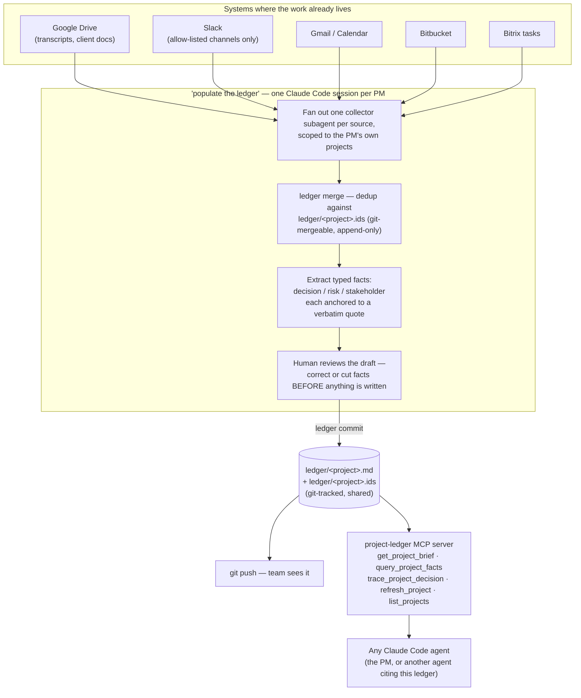

# Indicium AI Project Ledger

> Claude Code skills + collectors that populate a **per-project ledger** for project managers at Indicium — decisions, risks, and stakeholders, each anchored to a verbatim quote from the meeting or document it came from.

| Field | Value |
|---|---|
| Repository | [indiciumtech/indiciumai_project_ledger](https://bitbucket.org/indiciumtech/indiciumai_project_ledger/src/main/) (Bitbucket) |
| Organization | indiciumtech |
| Created | 2026-08-25 |
| Created by | Guilherme Tavares |
| Contributors | Guilherme Tavares, Lucas Zanotelli |
| Origin | Indicium AI 2026 Brazil Hackathon — created 2026-08-25, the same day as [gtc-knowledge-hub-agent](./gtc-knowledge-hub-agent.md) and one day before [gtc-knowledge-hub-collector](./gtc-knowledge-hub-collector.md), a different challenge than the Knowledge Hub's (no explicit "hackathon" mention survives in this repo's README/CLAUDE.md the way the collector's does, but the creation-date clustering and direct confirmation place it in the same event) |
| Role | Self-contained **Collection + Retrieval** pair for project-management state (not technical knowledge) |
| Maturity | v0 — actively developed (11 branches at time of writing: `drive-collector`, `multi-user-shared-ledger`, `refactor/coordinator-worker-collectors`, etc.) |

---

## 1. Product intent

> "A wiki page tells you what someone last remembered to write down. The ledger records *state*, and how it got that way."

Collector agents gather each project's activity from the systems where it lives — Google Drive (meeting transcriptions, client docs), Slack, Gmail, Google Calendar, Bitbucket, and Bitrix tasks. A merge step validates and dedups their output. An extraction pass turns it into **typed, quote-anchored facts**. Those facts are appended to one Markdown ledger per project (`ledger/<project>.md`).

Three design rules make this different from a wiki, stated in the repo's own `CLAUDE.md`:

1. **Every fact carries a verbatim quote.** No quote, no fact — extraction rejects rather than guesses.
2. **Nothing is ever overwritten.** A changed decision is a *new* fact that `supersedes` the old one — full lineage, both quotes, always walkable.
3. **The structure is the interface.** Facts are typed (`decision` / `risk` / `stakeholder`) with stable ids — agents get records to cite, not prose to paraphrase.

```markdown
## 2026-06-09

### D-14 · decision · supersedes D-7
**Move ingestion to Databricks** — Snowflake cost model broke at 4x projected volume
> Snowflake's not going to work at 4x, we're moving ingestion to Databricks
— drive · 1a2b3c · Architecture Review
```

---

## 2. Architecture



Re-running is safe by construction: processed source ids are recorded per project in the committed, **append-only** `.ids` files, which `git` union-merges cleanly across teammates and re-runs — no database transaction needed to avoid double-counting.

---

## 3. Data & vocabulary

| Fact type | Meaning |
|---|---|
| `decision` | A choice made, with its rationale, quote-anchored |
| `risk` | Something flagged as a risk to the project |
| `stakeholder` | A person relevant to the project's state |

| Concept | Meaning |
|---|---|
| `supersedes` | Marks a fact as replacing an earlier one — the full reversal, both quotes, stays walkable via `trace` |
| `.ids` file | Append-only, per-project, union-merged by git — the dedup/coverage ledger that makes concurrent runs safe |
| `private: true` | The project's ledger is written to `ledger/private/`, gitignored — never shared, all-or-nothing |
| `members` | The emails covering a project, in `config/projects/<slug>.json` — scopes `ledger status`/`--mine` for convenience. **Confirmed in code (`ledger.py`) to never gatekeep reads or writes** — it is a default, not an access-control mechanism |

### CLI surface (`uv run ledger --help`)

`projects` · `status` · `doctor` · `facts` · `brief` · `trace` · `find` · `log` · `merge` · `commit` · `tasks` · `whoami` · `bb` (Bitbucket activity group)

### MCP surface (`.mcp.example.json` → project-ledger)

`get_project_brief` · `query_project_facts` · `trace_project_decision` · `refresh_project` · `list_projects` — every record returned carries its quote, so a consuming agent cites the meeting instead of paraphrasing the ledger.

---

## 4. Governance — what is actually implemented (verified in code, not just docs)

| Mechanism | What it does | Where |
|---|---|---|
| **Fail-closed collector allow-lists** | Slack collector reads *only* the channel ids explicitly listed per project (`slack_channels`); DMs and group DMs are never read. Drive collector reads *only* files inside the listed `drive_folders` ids — no workspace-wide search. | `channels.py`, `config/projects/<slug>.json` |
| **Dedup filter** | `merge_collector_outputs()` drops anything already in `ledger/<slug>.ids` | `ledger.py` |
| **`.env` protection** | A `PreToolUse` hook blocks Edit/Write on `.env`, so credentials can't be accidentally edited/leaked via an agent session | `.claude/hooks/protect_env.py` |
| **Human review before write** | Draft facts are shown and can be corrected or cut before `ledger commit` | `.claude/skills/ledger/SKILL.md` |
| **Private project flag** | Whole-project opt-out from git, the only confidentiality control that exists today | `ledger.py` (`project_ledger_dir`) |

### What was searched for and confirmed **absent**

- No field-level redaction/masking (`grep`-ed the codebase for `redact`/`mask`/`sensitive`/`pii`/`financ`: the only hits are `bitbucket.py`/`client.py` scrubbing the Bitrix **webhook secret** from error logs — unrelated to client data).
- No per-reader access control at read time: `members` is documented in-code as scoping only `--mine`/`status`, explicitly **not** a write or read gate.
- No equivalent to the Knowledge Hub's `redaction_log` (category + rationale, value dropped). The design's own stated philosophy is "all or nothing": *"everything a fact carries — including its verbatim quote — is readable by everyone with repo access... for engagements where even that is too much, mark the project private."*

This matters because the collectors' own sources (client docs, Bitrix tasks, meeting transcripts) plausibly do capture the same sensitive categories the Knowledge Hub explicitly redacts (`commercial`, `client_financial`) — e.g. a `decision` or `risk` fact could verbatim-quote a contract value. Today, the only lever if that happens is hiding the *entire* project's ledger, not the one sensitive figure inside an otherwise shareable fact.

---

## 5. How this differs from the Knowledge Hub

This repository is functionally and architecturally unrelated to the [gtc-knowledge-hub-agent](./gtc-knowledge-hub-agent.md) / [gtc-knowledge-hub-collector](./gtc-knowledge-hub-collector.md) pair, despite living in a similar problem space ("don't let institutional knowledge walk out the door"). The repo's own `CLAUDE.md` makes the boundary explicit:

> "The ledger records **state**, not reference material — that distinction is deliberate, and it is what separates this from an enterprise knowledge system or a technical knowledge hub. Those answer 'how do we do X'; the ledger answers 'what is true about project Y right now, and how did it get that way.'"

| | Knowledge Hub (Agent + Collector) | Project Ledger |
|---|---|---|
| Answers | "How do we do X" — reusable technical knowledge | "What is true about project Y right now" — PM state |
| Capture mechanism | Live, agent-led **interview**, one question at a time, human confirms every item | **Automated** multi-source collector fan-out, human reviews a batch/day at a time |
| Storage | Postgres (relational, views, approval workflow) | Markdown + git (human-readable, git-diffable, append-only `.ids`) |
| Confidentiality control | `redaction_log` — category-based, field-level, value dropped | Binary `private` flag — whole project, all or nothing |
| Audience | Any Technologist company-wide | PMs on that specific project (in principle — not enforced) |
| Concurrency model | Postgres transactions | Git union-merge of append-only files |

---

## 6. What it solves

- Removes the "nobody writes it down" problem almost entirely: collection is cheap enough (background fan-out, not a scheduled interview) that it can run every time a PM opens a session, keeping ledgers close to real-time.
- Gives a fully auditable trail of *how* a decision changed, not just its current value — `trace_decision` walks the whole `supersedes` chain with both quotes attached.
- Makes overlapping work by different PMs safe by construction (append-only `.ids`, git merge) without needing a database or a locking mechanism.
- Exposes the same data to CLI (`ledger brief/trace/find`) and to any Claude Code agent via the `project-ledger` MCP server — one source of truth, two access paths.

## 7. What it does **not** solve

- **No field-level confidentiality.** As detailed above — a sensitive figure inside an otherwise-shareable fact cannot be hidden without hiding the whole project.
- **No enforced access control.** `members` is a UX convenience, not a permission system — anyone with a clone of the shared repo can read any non-private project's ledger in full, including its raw quotes.
- **Multi-user catalog is still local-first** for the sibling context tooling in this space, and this repo's own scaling story (shared vs. per-user state) is explicitly v0 — the roadmap defers scheduled ingestion, proactive drift detection, and effective-ACL capture.
- **Not a technical knowledge base.** Deliberately out of scope — the repo's own `CLAUDE.md` draws this line on purpose (see §5); it will not answer "have we used technology X before."

---

## 8. Sources

- Repository: https://bitbucket.org/indiciumtech/indiciumai_project_ledger/src/main/
- `README.md` — setup, usage, the full ledger ritual, and the stated Privacy model
- `CLAUDE.md` — conventions and the explicit "this is not a wiki / not a technical knowledge hub" boundary
- `config/projects/_example.json` — the full per-project config schema (members, private, allow-lists)
- `src/project_ledger/ledger.py`, `channels.py`, `config.py` — verified implementation of dedup, allow-lists, and the `private`/`members` behavior described above
- `.claude/skills/ledger/`, `.claude/skills/ledger-setup/` — the orchestrating and onboarding skills
