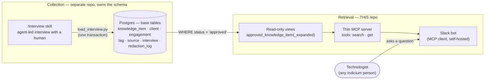
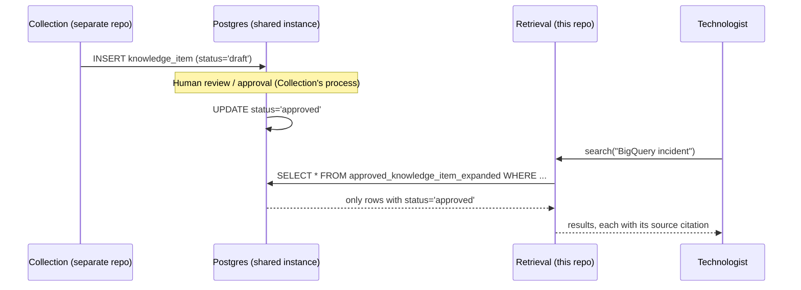

# GTC Knowledge Hub — Agent (Retrieval)

> An MCP server that lets Indicium people ask what the delivery teams have already learned — which technologies were used, which systems were integrated with, what went wrong before and who worked on it — without knowing where any of it was written down.

| Field | Value |
|---|---|
| Repository | [techindicium/gtc-knowledge-hub-agent](https://github.com/techindicium/gtc-knowledge-hub-agent) |
| Organization | techindicium |
| Created | 2026-08-25 |
| Created by | Vagner Strapasson |
| Contributors | Vagner Strapasson, Victor Giuliano |
| Origin | Indicium AI 2026 Brazil Hackathon (challenge #1) |
| Role in the system | **Retrieval** — reads the Knowledge Base, never writes to it |
| Sibling repository | [gtc-knowledge-hub-collector](./gtc-knowledge-hub-collector.md) — owns Collection and the schema |
| Maturity | Prototype / hackathon-scale (local Docker Postgres, no managed/production deployment found) |

---

## 1. Product intent

When someone rolls off an engagement, what they learned leaves with them. The **Knowledge Hub** is Indicium's attempt to capture technical knowledge from delivery teams as structured records so it can be queried later:

- "Where have we used technology X in a client project?"
- "I'm scoping an underwriting AI agent for an Insurance client — have we done this before?"
- "How many agentic AI projects have we done in FS&I, and who can I talk to about them?"

The product is split into two independent subsystems that share a common vocabulary ("Groundwork") but are built and owned separately:

This repository is the **Retrieval half only**. It reads; it does not capture, and it does not own the Knowledge Base schema (this boundary is formalized in [ADR 0014](https://github.com/techindicium/gtc-knowledge-hub-agent/blob/main/docs/adr/0014-knowledge-item-contract.md)).

---

## 2. Core vocabulary

Defined jointly with Collection in `CONTEXT.md` as **Groundwork** — neither side owns it alone.

| Term | Meaning | Avoid |
|---|---|---|
| **Knowledge Item** | The unit of retrieval: one self-contained technical assertion, typed and tagged, with its own provenance. Must be understandable without opening the original source. | document, page, record, insight |
| **Client** | The organization Indicium delivers for. Every Knowledge Item belongs to exactly one. | account, logo |
| **Engagement** | A specific piece of delivery work for a Client. May be absent — squad-level knowledge belongs to no single engagement. | project, workstream |
| **Technologist** | The person asking — the consumer of the Hub. | user, dev, consultant |
| **Engagement Team** | The people who worked on an Engagement, returned as "who might know more." **Not** an access-control list. | who to ask, owners |
| **Technology** | Tag dimension: what Indicium chose to build with (dbt, BigQuery, Airflow). | stack, tooling |
| **System** | Tag dimension: a third-party system integrated with, not chosen (Tasy, MV). Deliberately never collapsed with Technology. | technology, platform |
| **Methodology** | Tag dimension: a practice or technique, independent of stack. | process, framework |

### Knowledge Item types (defined by Collection's schema, read by this repo)

| Type | Meaning |
|---|---|
| `lesson_learned` | Something learned, not tied to one decision |
| `decision_record` | A decision made, and why |
| `pitfall` | Something that went wrong |
| `success_case` | Something that worked and is worth repeating |
| `problem_solution` | A concrete problem/solution pair |

---

## 3. What this repo actually exposes

Per [ADR 0001](https://github.com/techindicium/gtc-knowledge-hub-agent/blob/main/docs/adr/0001-thin-mcp-server.md), the server is deliberately **thin** — no answer synthesis:

| Tool | Purpose |
|---|---|
| `search` | Returns matching Knowledge Items (Postgres full-text search, ADR 0004/0015/0016) |
| `get` | Fetches one Knowledge Item by id |

There is no `ask(question)` tool. The reasoning: the calling MCP client already has a frontier model better at multi-step retrieval than a pipeline this repo would have to maintain — owning synthesis would mean owning hallucinations, an eval harness, and per-query inference cost for output the client produces anyway.

A **Slack bot** ([ADR 0006](https://github.com/techindicium/gtc-knowledge-hub-agent/blob/main/docs/adr/0006-slack-bot-as-mcp-client-in-this-repo.md), [ADR 0007](https://github.com/techindicium/gtc-knowledge-hub-agent/blob/main/docs/adr/0007-self-hosted-agent-runtime-for-slack-bot.md)) is bundled as *one* MCP client, self-hosted, so people can ask questions from Slack. It is a chat interface, not a visual dashboard — there is no web UI in this repo.

---

## 4. Data flow and governance

- **Approval** is a quality gate (item was reviewed), enforced entirely by the view `approved_knowledge_item` — the Retrieval code never filters on status itself, so an unreviewed item cannot leak by accident.
- **Redaction** is Collection's separate mechanism: a `redaction_log` records category (`pii`, `client_identity`, `commercial`, `client_financial`) and rationale, **never the removed value**. This repo never surfaces redaction data.
- **Open governance gap** (explicit in [ADR 0014](https://github.com/techindicium/gtc-knowledge-hub-agent/blob/main/docs/adr/0014-knowledge-item-contract.md)): approval is global, not per-reader. Whether every Indicium person may see every approved item's `client_name` and `Engagement Team` is, in the ADR's own words, *"an open question with Collection... the risk here is inheriting one by silence."* There is no per-role or per-client visibility filter today.

---

## 5. Key architectural decisions (ADRs)

| ADR | Decision |
|---|---|
| 0001 | Thin MCP server — `search`/`get` only, no synthesis |
| 0002 → amended by 0014 | Reads a Postgres index it does not populate; ingestion is out of scope |
| 0004 → superseded by 0014 | Postgres full-text search before vectors |
| 0005 | SQLAlchemy behind a repository — schema changes stay contained to two files |
| 0006 / 0007 / 0012 → dormant | Filtering logic for an ACL model that Collection ultimately did not build |
| 0009 → superseded by 0015 | Text search language config: `portuguese` initially, then `english` once Collection made the corpus English-canonical |
| 0013 | Wiki.js as a source route — found a real permission bug in Wiki.js's GraphQL API, handed off to Collection since ingestion isn't this repo's job |
| 0014 | **Knowledge Item Contract** — the load-bearing ADR: formalizes that Collection owns the schema independently; supersedes 0003/0004/0006/0007/0008/0009(partially)/0010/0012/0013 |
| 0017 | Golden Set corpus is a translated, page-level snapshot — used to measure retrieval quality over time |

---

## 6. What it solves

- Gives any Technologist a single place to ask "have we done this before" across all engagements, without knowing which Slack channel or Google Doc the answer lives in.
- Surfaces a "who to ask" pointer (the Engagement Team) alongside every result.
- Keeps the interface stable (`search`/`get`) even as Collection's schema evolves underneath, via the repository pattern (ADR 0005) and a pinned, vendored copy of Collection's schema for tests (`tests/contract/schema.sql`).
- Provides a Golden Set (real questions ↔ expected items) to measure whether retrieval quality improves or regresses over time.

## 7. What it does **not** solve

- **Does not capture knowledge.** It has no write path at all — that's entirely Collection's responsibility ([gtc-knowledge-hub-collector](./gtc-knowledge-hub-collector.md)).
- **Does not synthesize answers.** It returns raw Knowledge Items; the calling LLM (Slack bot's model) does the reasoning.
- **Does not filter by reader identity.** Approval is a single global switch; there is no mechanism to hide a client's name or Engagement Team from a subset of Indicium staff. Flagged as an open risk in ADR 0014, not yet resolved.
- **No vector search.** Only Postgres FTS today; the `pgvector` extension is provisioned in the dev image for future use but unused (ADR 0014: *"there is no full-text index and we cannot add one"* — Collection's schema has no `tsvector`/GIN, since ingestion isn't this repo's to change).
- **No production deployment evidence.** `compose.yaml` is explicitly a local developer/demo Postgres, seeded ad hoc from Collection's real seed data — there is no managed hosting, backup, or HA configuration in this repo.
- **No visible UI beyond Slack.** "Visual"/dashboard-style access does not exist here.

---

## 8. Sources

- Repository: https://github.com/techindicium/gtc-knowledge-hub-agent
- `CONTEXT.md` — shared Groundwork vocabulary
- `docs/adr/` — all architectural decisions referenced above
- `tests/contract/schema.sql` — Collection's schema, vendored and pinned for this repo's tests
- `scripts/dev-seed.sh` — how the local demo database is seeded from Collection's real data
- `golden-set.yaml` / `docs/golden-set.md` — retrieval quality evaluation set
- Sibling repository: [gtc-knowledge-hub-collector](./gtc-knowledge-hub-collector.md)
