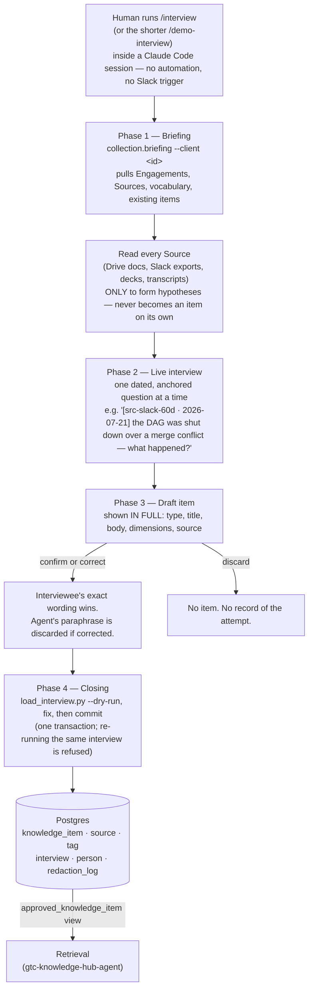
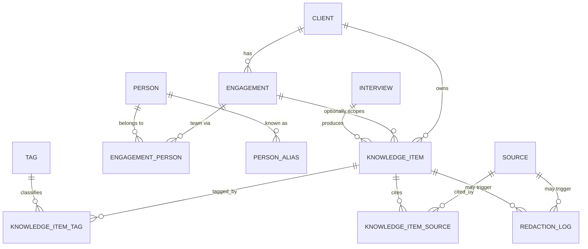

# GTC Knowledge Hub — Collector (Collection)

> Turns an interview or presentation from a delivery team into a structured, quote-anchored technical record — using an LLM-led interview to do the extraction, with every fact confirmed by a human before it is committed.

| Field | Value |
|---|---|
| Repository | [techindicium/gtc-knowledge-hub-collector](https://github.com/techindicium/gtc-knowledge-hub-collector) |
| Organization | techindicium (originally created under the personal account `gabrielvtwo`, later transferred) |
| Created | 2026-08-26 |
| Created by | Gabriel Bernardo |
| Contributors | Gabriel Bernardo, Guilherme Losso |
| Description (GitHub) | "Knowledge Hub Collector demo for Indicium AI 2026 Brazil's Hackathon to solve #1 challenge." |
| Origin | Indicium AI 2026 Brazil Hackathon (challenge #1) |
| Role in the system | **Collection** — owns the Postgres schema and the only write path into it |
| Sibling repository | [gtc-knowledge-hub-agent](./gtc-knowledge-hub-agent.md) — reads this repo's data through two views only |
| Maturity | Prototype / hackathon-scale. Retrieval is explicitly listed in this repo's own README as "Not started" (a Curation Screen exists, no MCP/search yet on this side) |

---

## 1. Product intent

Same underlying problem as the sibling repo: when someone rolls off an engagement, what they learned leaves with them. Capturing it is the hard part — teams are busy, and writing it down never happens on its own. This repo's answer is **not** passive extraction from documents; it is a live, agent-led interview where a human explicitly confirms every fact before it is stored.

---

## 2. Core vocabulary

Shared "Groundwork" with the sibling repo, defined in `CONTEXT.md` — read there before working in either repo.

| Term | Meaning |
|---|---|
| **Source** | An artifact of origin (Slack channel/message, Google Doc, transcript, repository, ADR, spreadsheet...). Feeds the interview's **questions**; never generates a Knowledge Item by itself ([ADR 0001](https://github.com/techindicium/gtc-knowledge-hub-collector/blob/main/docs/adr/0001-source-como-briefing-nao-como-insumo.md)). |
| **Interview** | A session conducted by the agent. In the target state, every Knowledge Item is born from a human-confirmed statement here. |
| **Person** | Only Indicium people are named rows. A client-side person's identity is Restricted Data and becomes a `redaction_log` entry — never a row here. |
| **Redaction** | Auditable record that Restricted Data was removed: category + rationale only, **never** the removed content itself. |
| **Triage** | Off-scope content (jokes, small talk, market news). Produces nothing at all — no item, no redaction, no question. |
| **Controlled / Proposed tag** | A tag is `controlled` once ratified by Groundwork, `proposed` while it awaits promotion or discard by a human. |

### Data model (Postgres, owned here)

| Knowledge Item type | Meaning |
|---|---|
| `lesson_learned` | Something learned, independent of one decision |
| `decision_record` | A decision made and its rationale |
| `pitfall` | Something that went wrong |
| `success_case` | Something that worked — the type only ever gets filled by directly asking for it |
| `problem_solution` | A concrete problem/solution pair |

| Tag dimension | Meaning |
|---|---|
| `technology` | What Indicium chose to build with |
| `system` | A third-party system integrated with, not chosen |
| `methodology` | A practice/technique, independent of stack |

| Redaction category | Meaning |
|---|---|
| `pii` | Personal data |
| `client_identity` | A client-side person's identity |
| `commercial` | Indicium's markup, contract pricing, profitability |
| `client_financial` | The client's own financial figures (revenue, chargebacks, pricing) |

---

## 3. Governance mechanisms actually implemented

| Mechanism | What it does | Where |
|---|---|---|
| **Mandatory human confirmation** | Every item is shown in full before writing; corrections replace the agent's text verbatim; discard means no record at all | `.claude/skills/interview/SKILL.md`, Phase 3 |
| **Source ≠ Item** | Raw material can only motivate a question, never become a record unsupervised | ADR 0001 |
| **Approval status** | `draft` / `approved` / `rejected`, with `approved_by`/`approved_at` required together | `knowledge_item` table constraints |
| **Redaction log** | Structured, auditable removal of Restricted Data — pattern kept, value dropped | `redaction_log` table |
| **Idempotent commit** | `load_interview.py` refuses to re-run the same interview twice | Phase 4 |
| **English-only knowledge base** | Every item is drafted/confirmed in English regardless of the interview's spoken language, so nothing needs later translation | [ADR 0005](https://github.com/techindicium/gtc-knowledge-hub-collector/blob/main/docs/adr/0005-knowledge-item-consolidado-em-ingles.md) |

**What is not implemented:** no per-reader access control (approval is a single global switch, not scoped by role or client), and no field-level masking beyond the manual redaction step a human performs during the interview itself.

---

## 4. Key architectural decisions (ADRs)

| ADR | Decision |
|---|---|
| 0001 | Source feeds Interview questions — it never generates a Knowledge Item on its own |
| 0002 | Relational Postgres, not graph/vector store, for v1 |
| 0003 | Knowledge Item requires a Client; Engagement is nullable (squad-level knowledge exists) |
| 0004 | `technology` and `system` are distinct tag dimensions, deliberately never collapsed |
| 0005 | Knowledge Base consolidated in English — the interview is conducted in whatever language the interviewee prefers, but every committed item is in English |

---

## 5. What it solves

- Converts tacit, conversational knowledge (what actually happened on an engagement) into a typed, queryable record — something a document dump or a raw Slack export cannot do on its own.
- Produces a **self-contained** record: readable and useful without reopening the original transcript.
- Gives every fact a real human owner who explicitly vouched for its wording, which is what makes the record trustworthy enough to be cited to people who were never on the engagement.
- Keeps client-confidential and commercially sensitive detail out of a broadly-shared knowledge base through an auditable, category-based redaction step, rather than an ad hoc "just don't write that down."

## 6. What it does **not** solve

- **Coverage.** Interviews are expensive — a multi-hour source read plus a live conversation per person. Most engagement knowledge will simply never get an interview scheduled. There is no passive/background collection here.
- **Freshness.** Nothing refreshes on its own; knowledge only updates when someone deliberately re-runs `/interview`.
- **Backfill is not a real pipeline.** `knowledge_item.origin = 'backfill'` exists in the schema for content "extracted from Source without human validation," but no script implements it in this repo — it was used once, to load the original 18-item seed (`data/db/seed.sql`), and the schema comment itself flags it as contradicting ADR 0001: bootstrap-only, not a steady-state channel.
- **Retrieval.** By this repo's own README, Retrieval is "Not started" on the Collection side — a Curation Screen (view extracted data without SQL) exists, but querying by Technologists is entirely the sibling repo's job.
- **Per-reader visibility.** Same gap as the Retrieval side: approval is global, not scoped by client or role.
- **No production deployment evidence.** This is explicitly a hackathon demo project; no managed hosting, backup, or access-control infrastructure was found.

---

## 7. Sources

- Repository: https://github.com/techindicium/gtc-knowledge-hub-collector
- `CONTEXT.md` — shared Groundwork vocabulary
- `docs/adr/` — all five ADRs referenced above
- `docs/architecture/data-model.md` — full logical/physical data model
- `.claude/skills/interview/SKILL.md` and `.claude/skills/demo-interview/SKILL.md` — the interview ritual, in full
- `data/db/schema.sql` / `data/db/seed.sql` — the schema and the original 18-item real seed data
- Sibling repository: [gtc-knowledge-hub-agent](./gtc-knowledge-hub-agent.md)
