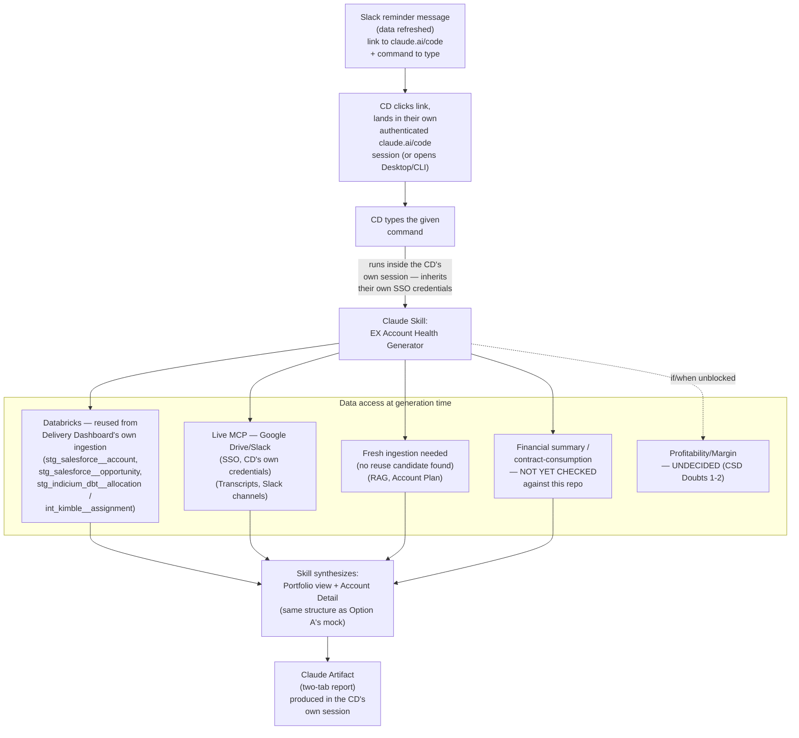
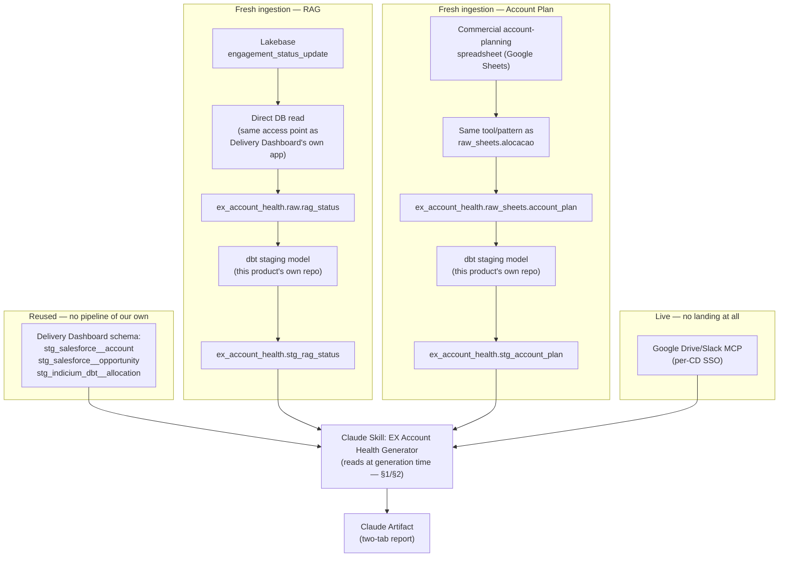

# EX Account Health — Architecture Draft: Option B (On-Demand Claude Skill)

**Status: draft, for validation — not decided, not yet reviewed with any stakeholder.**
Scope: this document covers *only* the generation-and-delivery architecture for Option B, one of the two open options in the PRD's Section 7 ("Delivery/consumption layer — undecided"). The report's *content* (two-tab Portfolio + Account Detail structure) is unchanged from what's already defined in the PRD — this is strictly about how that content gets produced and handed to the CD.

Companion to Option A (persistent app) — not a replacement. Both remain open until a decision is made.

---

## 1. What Option B actually is

Instead of a persistent, always-updated app, the report is generated **on demand** by a Claude skill: nothing is pre-rendered and sitting around stale — the skill runs, gathers the current data, and produces a fresh Claude Artifact each time.

**Single path, corrected after checking two things that don't exist today:** skills only work in Claude Code (CLI, Desktop, or the `claude.ai/code` web surface) — **not** in the general claude.ai chat — and there is no "Sign in with Slack" for claude.ai accounts, nor any other way to authenticate *as* a specific CD without them being present in their own session. That rules out a fully unattended, button-triggered run (there is no way to run the skill "on the CD's behalf" without them there to carry their own SSO credentials for the transcript/Slack MCPs). So this collapses to one flow, not two:

1. Slack sends the CD a **reminder message** (not a trigger) when the underlying data has refreshed: a clickable link to `claude.ai/code`, plus the exact command/prompt text to type once there.
2. The CD clicks the link, lands in their own already-authenticated `claude.ai/code` session (or opens Desktop/CLI directly, bypassing Slack entirely if they prefer).
3. The CD types the given command. The skill runs **inside the CD's own session**, so it inherits their own SSO credentials for free — no delegated/stored credential, no webhook, no separate backend service.
4. The skill produces a Claude Artifact (the two-tab report) inside that same session.

Slack's role stays exactly what the PRD already says (notification + link only) — this just makes explicit that "the link" always lands on `claude.ai/code`, never on general claude.ai, and that no click can skip the CD actually being present to run the command themselves.

**Also confirmed about this flow (08/21/2026, Lorena):**
- The CD is willing to open `claude.ai/code` (not general claude.ai) and type a command each time — a small but real extra step compared to Option A's always-there app.
- The skill is packaged as its own distinct, named skill (its own repo, its own fixed command — `/ex-account-health`) — not folded into a broader, general-purpose Claude Code/agent setup as one capability among many.
- Each run produces a **new** Claude Artifact — never updates one persistent artifact. No retention/versioning convention for past reports — only the latest matters; any future historical need is served from the Delivery Dashboard's own database, not this skill's output.
- This generation logic lives in **its own repository**, consistent with the earlier decision (08/05/2026) to give EX Account Health its own repo rather than extending `ai_databricks_daily_intelligence` — holds regardless of whether Option A or B is ultimately chosen.

---

## 2. Data access: two different paths, per concept

Per this round's decision, the skill does **not** use a single access strategy — it combines live MCP calls with reads from an already-ingested Databricks layer, depending on the concept. Mapped against the PRD's Data Concepts table (Section 7):

| # | Concept | Access path at generation time | Why |
|---|---|---|---|
| 1 | Account | ✅ **Reuse candidate, confirmed 08/21/2026: `stg_salesforce__account`** (`dbt/models/staging/salesforce/`) — a generic, thin pass-through of the raw Salesforce Account object (id, name, industry, owner_id, region-relevant fields, etc.). Databricks read, not live MCP. | Reusable because it's a clean SF representation, not DD-specific — do **not** reuse `dim_account` instead (marts/core): that one blends in a completely separate, Salesforce-free Americas leg and derives its own `region`/owner logic, which this product doesn't want to inherit. |
| 2 | CD (Person) | N/A — resolved from the CD's own identity/session, not fetched | Scoping input, not report content |
| 3 | RAG Status | 🚧 **No reusable path — needs fresh ingestion.** Checked directly in the Delivery Dashboard repo (08/21/2026): the real data lives in Lakebase (`engagement_status_update`), read client-side, **bypassing dbt entirely** — the dbt staging model for it (`stg_dashboard__engagement_status_updates.sql`) is a stub with `WHERE 1 = 0` (zero rows), by their own architecture decision. | Not just an ingestion gap — a **shape mismatch**: Delivery Dashboard's write-back models only 3 sub-statuses (delivery/risk/commercial), not the 4 blocks (Profitability, Delivery Health & Pulse, Growth, Risks) this product assumes. See the new open question below — this isn't resolved, just surfaced. |
| 4 | Commercial Pipeline / Opportunity | ✅ **Reuse candidate, confirmed 08/21/2026: `stg_salesforce__opportunity`** (or its enrichment, `int_salesforce__opportunity`, which adds currency conversion and customer-history flags) — close to a generic staging model; carries stage, probability, amount, close date, forecast_status. | Mostly generic, with two light business rules worth knowing about (not disqualifying): a `forecast_status` bucketing off probability, and a **null-region defaulting to 'Europe'** — this one is now higher-stakes than a minor caveat, given this product is Americas-scoped: any opportunity with a blank region field would be silently miscategorized as Europe and excluded from an Americas-scoped filter. Must be checked/handled explicitly. Do **not** reuse `fct_pipeline` or `dash_portfolio_sales` (marts): both are DD-specific — `fct_pipeline` is hard-filtered to open/未-closed opportunities only plus a bespoke FTE-sizing calc, and `dash_portfolio_sales` is pure DD screen-presentation layer. |
| 5 | Financial summary / contract consumption | Live MCP (Salesforce) — **not yet checked against the Delivery Dashboard repo** (this pass only confirmed reuse for Account/Opportunity, not for contract-consumption fields specifically) | Same Salesforce integration as #1/#4, but whether a reusable table exists for billed-vs-total-contract-value specifically is still open — worth a follow-up check, not yet done |
| 6 | Account Plan / Target | 🚧 **No reusable path — needs fresh ingestion.** Checked directly in the Delivery Dashboard repo (08/21/2026): no ingestion of a Commercial account-planning spreadsheet exists anywhere in it (searched for `kantata`, `account_plan`, `target`). The closest adjacent asset, `fct_pipeline`/`dash_portfolio_sales`, models Salesforce opportunity pipeline at the opportunity grain — not an account-level monthly revenue target. | Confirmed gap, not an assumption anymore — this product needs its own ingestion of the account-planning spreadsheet. |
| 7 | Profitability / Margin (GM%) | **Undecided — see Open Question 1 below** | Still governance + access blocked (CSD Doubts 1–2); if unblocked, likely follows the same path as #6. **Note (08/21/2026):** Salesforce is not a viable path regardless — its margin fields (`Sold_Margin__c`/`Margin_Amount__c`) are confirmed Europe-only, and this product is Americas-scoped. |
| 8 | Narrative signal — meeting transcripts | Live MCP (Google Drive, SSO with the CD's own credentials) | Per-CD access boundary (optional-attendee-or-better) only makes sense evaluated live, not pre-ingested for all CDs |
| 9 | Narrative signal — Slack channels | Live MCP (Slack, same SSO mechanism as #8) | Same reasoning as #8 |
| 10 | Squad allocation | ✅ **Real reuse candidate, confirmed 08/21/2026: `stg_indicium_dbt__allocation.sql`** — a generic (not Delivery-Dashboard-specific) staging model, a 1:1 port of the same Operations allocation spreadsheet (`raw_sheets.alocacao`) this product would otherwise re-ingest (full_name, allocation_status, team, squad, allocation dates, coordination, job_role). *(Kimble's `int_kimble__assignment[_daily]` is Delivery Dashboard's Europe-side equivalent — not relevant here, since this product is Americas-scoped.)* | Because it's a *generic staging model*, not a purpose-built Delivery Dashboard mart, this product can point at the same table instead of rebuilding the ingestion — genuine reuse, not just "same spreadsheet, separate pipeline." Kantata (the planned replacement) has no footprint in that repo yet. |
| 11 | Key contacts | 🚧 **Checked, still no usable source.** `stg_salesforce__contact` exists (keyed by `account_id`) but is deliberately redacted for external contacts: name is scrubbed to `'Contact: ' || id` and email to `id || '@na.com'` unless the domain is `@mesh-ai.com`/`@indicium.ai` — i.e., real client-side names/emails are stripped out by design. | Confirms rather than resolves the gap — this isn't "no one built it yet," it's "the closest existing table intentionally can't carry this data." Carried over from the PRD as an open gap. |

**Correction (08/21/2026, Lorena):** items 1, 3, 4, 6, and 10 were previously written generically as "Live MCP (Salesforce)" or flagged as unconfirmed, without actually checking the Delivery Dashboard repo for a reusable table. Checked directly instead of assuming further: Account and Commercial Pipeline/Opportunity both turned out to have clean, generic staging-model reuse candidates (avoid the DD-specific marts built on top of them); RAG and Account Plan both turned out to have **no reusable path at all** (fresh ingestion needed for both, and RAG also has a shape mismatch — see Section 6 below); Squad allocation turned out to have a **real, confirmed reuse candidate** (a generic staging model, not a DD-specific mart); Key contacts was checked and confirmed still unusable, not just unconfirmed.

**Pattern (revised 08/21/2026, after checking the Delivery Dashboard repo directly):** anything that requires the CD's own personal access boundary (transcripts, Slack — items 8–9) has to be live MCP, evaluated per-CD, per-run. Account (#1), Commercial Pipeline/Opportunity (#4), and Squad allocation (#10) all have confirmed, reusable Databricks staging models already built for Delivery Dashboard's own Salesforce/allocation ingestion — this product should read from those directly instead of standing up its own Salesforce MCP or re-ingesting the allocation spreadsheet. RAG (#3) and Account Plan (#6) have no such reuse candidate and need fresh ingestion. Financial summary/contract-consumption (#5) hasn't been checked yet against this repo.

---

## 3. Diagram

---

## 4. Open architecture questions — not decided, flagged for validation

*(The RAG shape mismatch and the fresh-ingestion need for RAG/Account Plan — previously listed here — are now covered in Section 6, "Ingestion & Pipeline Architecture," which is where the detail actually lives. Kept only the two items below that aren't pipeline-specific.)*

1. **Profitability/Margin path.** Still blocked by CSD Doubts 1–2 (governance + access). If/when unblocked: same path as Account Plan/Squad allocation (§2, items 6/10), or something else given its access-restricted nature? Not addressed by this draft.
2. **Key contacts (concept #11).** No source at all today. Out of scope until a source exists.

*(Resolved questions from earlier rounds — authentication for an unattended trigger, freshness footer, artifact retention, command discoverability, repo ownership, skill packaging — are recorded in the scratchpad's Judgment Calls Log, 08/21/2026 entries, and already reflected in §1 and §2 above.)*

---

## 5. Technical Requirements — Pre-flight Checks & Failure Handling

Everything below happens **as soon as the skill is triggered** (i.e., right after the CD types the command in §1, before any data is fetched) — not vaguely "before generating the report." The skill must not attempt to gather data from a source it hasn't verified it can reach.

| # | Check | Timing | If it fails |
|---|---|---|---|
| 1 | **CD identity** — who is running this | As soon as the skill is triggered | Validated via **Google SSO** (the same identity the CD already uses for the Drive/Slack MCP). If this can't be validated, the skill cannot know whose portfolio to scope to and must stop before touching any data source. |
| 2 | **MCP connection — Google Drive + Slack** | As soon as the skill is triggered | If not configured, walk the CD through enabling it in the simplest possible terms, as if for someone with no technical background. |
| 3 | **Databricks access** — reused Delivery Dashboard staging tables (`stg_salesforce__account`, `stg_salesforce__opportunity`, `stg_indicium_dbt__allocation`/`int_kimble__assignment`), plus fresh-ingestion tables for RAG and Account Plan once built | As soon as the skill is triggered | Not a personal integration the CD can enable themselves — if access is missing, the skill must point to whoever grants it (Operations/Delivery Dashboard's own access-matrix, → R8), not offer a self-service setup step. |
| 4 | **Account → CD mapping completeness** — does the CD's expected account list match what's in `stg_salesforce__account`/`stg_salesforce__opportunity` | While reading Databricks-sourced Salesforce data (#3) | If accounts are missing or mismatched, the skill does **not** try to infer or correct this itself — it tells the CD, who needs to fix the Salesforce record (ownership field) directly. |
| 5 | **Meeting transcript not found** for a given account/period | While generating the narrative synthesis block | The skill states explicitly that there's no data for that gap — never a silent empty section — and asks the CD if they want to provide a link to a specific meeting instead. |
| 6 | **Partial source failure** (e.g., Salesforce reachable, Drive/Slack MCP is not) | During generation, after the pre-flight checks above have already passed for at least one source | The report still generates from what's available; the affected block is marked as unavailable rather than silently empty or blank — ties into the V1 freshness/sources footer (PRD item #10). |

*(The financial summary/contract-consumption data source is still unconfirmed against the Delivery Dashboard repo — tracked in §2 item #5 and §6.1, not repeated here as a pre-flight check since there's no real check/fallback logic yet, only an open research item.)*

**Note on scope:** skill *distribution* (making the skill available to all 8 CDs' Claude accounts) is an org-level rollout concern, not a per-run technical requirement — out of scope for this table.

---

## 6. Ingestion & Pipeline Architecture — Tooling, Extraction, Landing, Transformation

Sections 1–6 cover what happens *at generation time* (the skill reads already-materialized tables). This section covers what has to exist *before* that: how each fresh-ingestion source gets from its raw origin into a queryable table. Three decisions confirmed this round (08/21/2026, Lorena):

1. **Account Plan ingestion reuses the same tool/pattern as Delivery Dashboard's `raw_sheets`** (the mechanism that already lands the Operations allocation spreadsheet as `raw_sheets.alocacao`) — pointed at a new sheet, not a new tool.
2. **RAG Status is extracted by reading Lakebase directly** (`engagement_status_update`) — the same access point Delivery Dashboard's own app uses, bypassing dbt exactly as they do, rather than trying to re-ingest an upstream spreadsheet.
3. **EX Account Health gets its own schema/catalog in Databricks**, separate from `delivery_dashboard` — it only ever **reads** the reused Delivery Dashboard tables (§2, items 1/4/10), never writes to that schema, and lands/transforms everything it ingests fresh into its own space.

### 6.1 Per-concept pipeline

| Concept | Source | Extraction | Landing (raw) | Transformation | Materialized in |
|---|---|---|---|---|---|
| Account, Commercial Pipeline/Opportunity, Squad allocation | Delivery Dashboard's own staging models (§2, items 1/4/10) | **None — cross-schema read.** No extraction job of our own; queried directly from `delivery_dashboard`'s schema at generation time. | N/A | N/A (already transformed by Delivery Dashboard) | N/A — read live from `delivery_dashboard.stg_salesforce__account` / `__opportunity` / `stg_indicium_dbt__allocation` |
| RAG Status | Lakebase `engagement_status_update` | Direct DB read/connection to Lakebase (same access point as Delivery Dashboard's own app) | `ex_account_health.raw.rag_status` (new schema) | New dbt staging model, built in this product's own repo — Delivery Dashboard's stub (`WHERE 1 = 0`) can't be reused | `ex_account_health.stg_rag_status` (still only 3 of 4 sub-statuses — Open Question 1 unresolved) |
| Account Plan / Target | Commercial account-planning spreadsheet (Google Sheets) | Same tool/mechanism as `raw_sheets.alocacao`, pointed at this spreadsheet | `ex_account_health.raw_sheets.account_plan` (mirrors Delivery Dashboard's naming convention, own schema) | New dbt staging model, this product's own repo | `ex_account_health.stg_account_plan` |
| Financial summary / contract consumption | Salesforce — not yet confirmed against the Delivery Dashboard repo (§2, item #5) | **Pending follow-up check** — depends on whether a reusable table turns up (same as row 1) or this needs its own extraction | — | — | — |
| Profitability / Margin (GM%) | Undecided (CSD Doubts 1–2); Salesforce ruled out — Europe-only, this product is Americas-scoped | — | — | — | — |
| Narrative — meeting transcripts, Slack | Google Drive/Slack MCP, per-CD SSO | **None — live read at generation time**, no pipeline | N/A | N/A | N/A (never landed/materialized — inherently a live, per-CD read) |
| Key contacts | No usable source (§2, item #11) | — | — | — | — |

### 6.2 What happens after extraction

For the two rows that land data (RAG, Account Plan): raw data arrives in `ex_account_health`'s own raw schema on whatever schedule the extraction job runs → a dbt job (this product's own repo) builds staging models on top, with tests (e.g., row-count sanity, not-null on key fields) → the resulting tables are what the skill actually queries at generation time (§2). The reused Delivery Dashboard tables need no such step — they're already fully transformed, we only read them.

### 6.3 Diagram

### 6.4 Open questions — not decided, flagged for validation

1. **Exact tool behind `raw_sheets`.** This draft assumes reuse (per this round's decision) but the actual mechanism (Fivetran, Airbyte, a custom script, something else) hasn't been identified — needed before this can actually be implemented, not just planned.
2. **Refresh cadence for Account Plan and RAG ingestion.** Ties directly into the V1 freshness footer (PRD item #10) — if `raw_sheets` runs, say, nightly, and the Lakebase read is real-time, that gap needs to be shown, not assumed away.
3. **Lakebase read access.** A new access-grant dependency, not yet requested: does this product's Databricks workspace/service principal have (or can get) read access to Delivery Dashboard's Lakebase instance? Similar in nature to R8, but Lakebase-specific — worth its own line item, not folded into R8 silently.
4. **Orchestration tool for the new dbt jobs** (RAG, Account Plan) — Databricks Workflows, Airflow, dbt Cloud, or something else? Not checked against what Delivery Dashboard itself uses; assumed to mirror it is a reasonable default but not confirmed.
