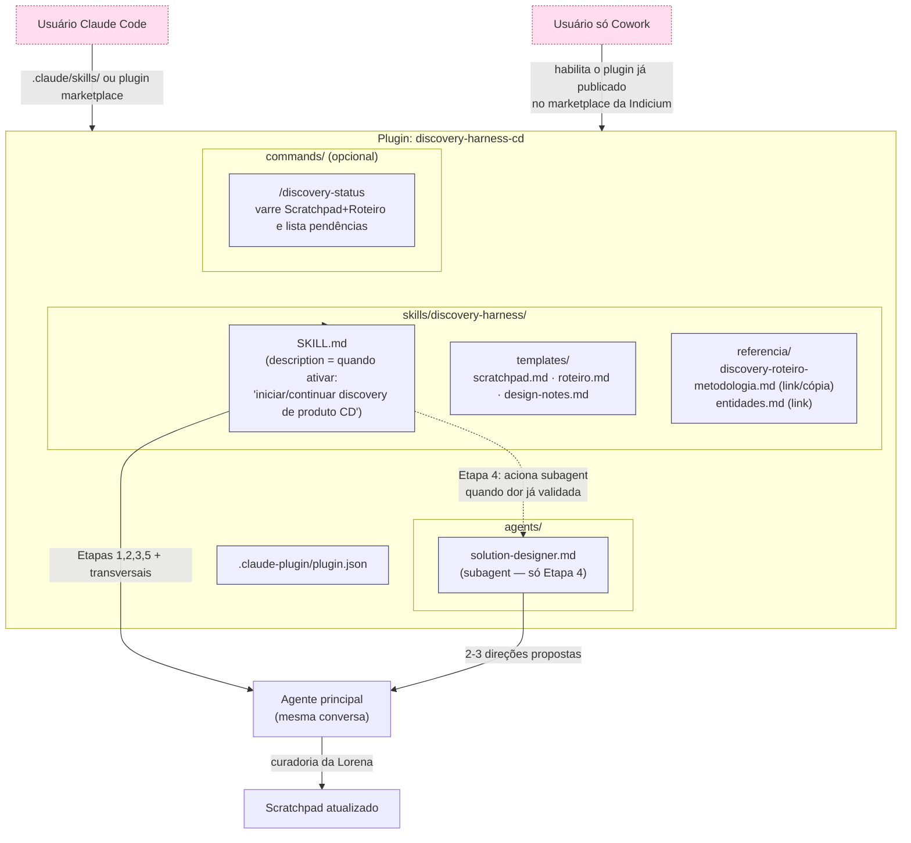
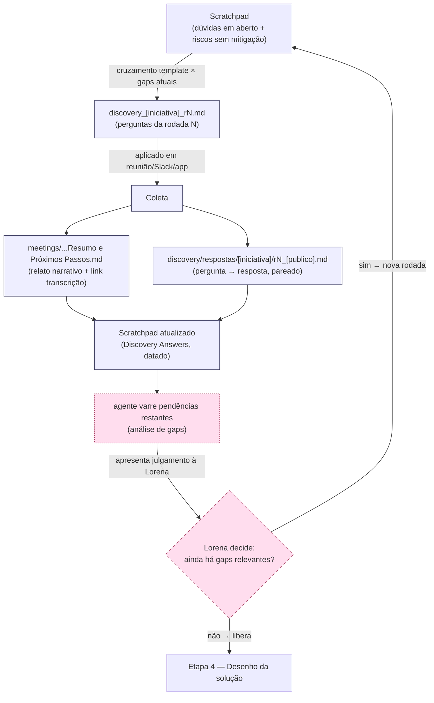
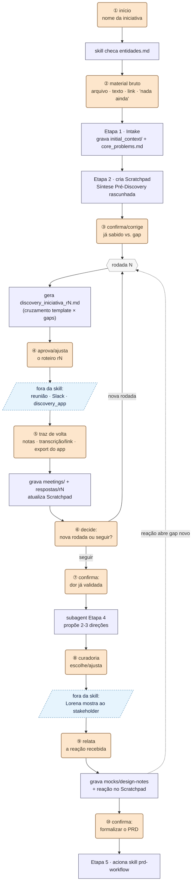

# Implementação do Harness de Discovery — Skill, Subagent ou Plugin?

Este documento resolve o item "Em aberto" nº1 de `discovery-harness.md`: **como formalizar o harness na prática**, dado que a solução precisa funcionar tanto para quem usa Claude Code quanto para quem usa **apenas Claude Cowork** (sem CLI, sem terminal, sem acesso a arquivos `.claude/` locais no mesmo sentido).

Isto é uma proposta técnica para curadoria da Lorena — não uma decisão tomada. Ver "Perguntas abertas" no final.

---

## 1. Os três primitivos disponíveis, e o que cada um realmente é

| Primitivo | O que é | Onde funciona hoje (ago/2026) | Portabilidade |
|---|---|---|---|
| **Skill** (`SKILL.md` + recursos) | Pacote de instruções + arquivos de apoio (templates, scripts, roteiros) que o modelo carrega quando relevante, por descrição ou invocação explícita (`/nome`) | Claude.ai, Claude Code, **Claude Cowork**, API — formato aberto desde dez/2025 | Alta — mesmo arquivo funciona nas 4 superfícies sem alteração |
| **Subagent** (`.claude/agents/*.md`) | Um agente especializado, com prompt e ferramentas próprias, chamado pelo agente principal para uma sub-tarefa isolada (contexto separado) | Claude Code nativamente; no Cowork aparece **embutido dentro de "agent templates"/plugins**, não como arquivo solto | Média — não é um artefato standalone fora do Code; no Cowork só chega via plugin |
| **Plugin** | Bundle de skills + subagents + slash commands + hooks + conectores MCP, distribuído como uma unidade instalável | Claude Code (estável); **Claude Cowork (research preview, contas pagas)** | Alta como *unidade de distribuição*, mas em preview no Cowork — Anthropic recomenda não usar em workloads regulados ainda |

**Achado que muda a decisão:** plugin não é mais "recurso exclusivo do Code" — ele já roda em Cowork, só que em preview. Subagent sozinho (fora de um plugin) não é um artefato que um usuário só-Cowork consegue instalar diretamente hoje.

---

## 2. Cruzando com as 5 etapas do harness

| Etapa | Precisa de quê, tecnicamente | Skill sozinha resolve? | Precisa de subagent? |
|---|---|---|---|
| 1. Intake | Checklist + checagem de `entidades.md` | Sim | Não |
| 2. Scratchpad | Template + regras de edição (nunca nomes reais, hipótese vs. confirmado) | Sim | Não |
| 3. Roteiro estruturado | **Não** é instanciar o banco de perguntas genérico de `discovery-roteiro-metodologia.md` como está — é cruzá-lo com o que a Etapa 1 já extraiu do `initial_context/`: ponto já respondido no material bruto não vira pergunta (fica só como fato conhecido, com fonte); ponto parcial vira pergunta específica formulada em cima do que já se sabe; só ponto sem pista alguma herda a pergunta-molde quase literal. O roteiro final é sempre mais curto e mais direcionado que o template, nunca o template aplicado igual em toda iniciativa | Sim — mas a `SKILL.md` precisa instruir esse cruzamento explicitamente, não só "gerar um roteiro" | Não |
| 4. Desenho da solução | Gerar 2–3 direções comparáveis (mock e/ou arquitetura) a partir do Scratchpad, **sem contaminar o contexto principal** com ideação solta | Parcialmente — funciona sem subagent, mas um subagent isola a "sessão de ideação" do restante da conversa e força a curadoria antes de voltar | Recomendado, não obrigatório |
| 5. Formalização do PRD | Já é resolvido pela skill `prd-workflow` existente — o harness só precisa *alimentá-la* corretamente | Sim (o harness não recria isso) | Não |
| Transversais (alerta de pendências, registro de entidades, compress) | Comportamento contínuo, não um passo com início/fim | Sim — vai na *description* da skill, não numa etapa separada | Não |
| **Persistência de arquivos/links** (transversal, adicionado 2026-09-03) | Sempre que a skill identificar um arquivo anexado ou um link colado na conversa (Google Drive, upload no chat, etc.) que ainda não esteja salvo na pasta local da iniciativa, perguntar explicitamente à Lorena se deseja persisti-lo (ex. em `initial_context/[iniciativa]/` ou `discovery/respostas/[iniciativa]/`) antes de seguir — nunca salvar de forma proativa sem essa confirmação | Sim — vai na *description*/instruções da skill, mesmo padrão "avisa, não decide" já usado no alerta de pendências | Não |

Conclusão desta seção: **nenhuma etapa exige um subagent obrigatoriamente**; a Etapa 4 é a única onde ele agrega valor real (isolamento de contexto durante ideação). Validado empiricamente por Lorena em 2026-09-03: pedir explicitamente a Claude para (a) transformar um link do Google Drive em arquivo na pasta local e (b) salvar um arquivo enviado no chat na pasta local — ambos funcionaram, dentro de um Cowork project com workspace folder já anexada (ver Seção 6.4 para a precondição de setup).

---

## 3. Recomendação

> **Skill principal + subagent opcional para a Etapa 4, empacotados num plugin, distribuído via marketplace da Indicium.**

Por quê, em ordem de peso:

1. **Cowork-first é o requisito que elimina "subagent solto"** — o único jeito de um subagent chegar a um usuário só-Cowork hoje é dentro de um plugin. Then o plugin já é necessário de qualquer forma.
2. **Decisão da Lorena (2026-09-03): cópia manual da pasta de skill não é um caminho viável.** O plugin deve viver dentro do marketplace da Indicium já em uso (o mesmo de onde já vem, por exemplo, o plugin "Indicium ai branding") e ser apenas habilitado/chamado dentro do Cowork — sem exigir que o usuário gerencie arquivos de skill manualmente. Isso torna o empacotamento como plugin **obrigatório**, não uma opção com fallback: não existe mais um "caminho B" de skill solta copiada à mão.
3. **Empacotar como plugin não custa nada extra estrutural** — um plugin é literalmente uma pasta com `skills/`, `agents/`, `commands/`, um manifesto. A skill que você escreveria de qualquer forma vira o conteúdo de `skills/discovery-harness/`.
4. **Isso resolve a portabilidade sem duplicar manutenção**: um único repositório-fonte, uma única forma de consumo — plugin instalado a partir do marketplace da Indicium, tanto em Code quanto em Cowork.

### O que isso NÃO é
Não é uma automação que decide sozinha quando mudar de etapa ou o que validar — o harness é enfático que validação com stakeholder e alerta de pendências são comportamentos contínuos, não gates. A skill deve **instruir** o agente a se comportar assim, não codificar um fluxo rígido tipo state machine.

---

## 4. Arquitetura proposta



### Estrutura de pastas do pacote

```
discovery-harness-cd/                      ← repo do plugin (pode ser público ou privado)
├── .claude-plugin/
│   └── plugin.json                        # nome, versão, entrypoints
├── skills/
│   └── discovery-harness/
│       ├── SKILL.md                       # instruções das 5 etapas + comportamentos transversais
│       └── templates/
│           ├── scratchpad-template.md
│           ├── roteiro-template.md
│           └── design-notes-template.md
├── agents/
│   └── solution-designer.md               # subagent da Etapa 4 (opcional, v2)
└── commands/
    └── discovery-status.md                # opcional: gatilho manual para "análise de gaps"
```

Este pacote vive **fora** de `consulting_director/` (é infraestrutura de processo, reutilizável por qualquer iniciativa CD futura) — mas o `SKILL.md` referencia, por caminho relativo documentado, os arquivos que continuam morando neste repo (`discovery-roteiro-metodologia.md`, `entidades.md`, os próprios scratchpads). O plugin não duplica conteúdo, só aponta para ele.

---

## 5. Estrutura de pastas gerada no repositório do usuário (runtime)

A seção 4 mostrou a estrutura do **pacote** (o plugin em si, como é distribuído). Esta seção é diferente: é o que a skill efetivamente lê e escreve **dentro do repositório de trabalho do usuário** (ex.: `consulting_director/`) conforme o discovery avança — incluindo o loop de rodadas descrito na seção 6.

```
consulting_director/                                   ← repositório do usuário (não é o plugin)
├── initial_context/
│   ├── core_problems.md
│   ├── entidades.md
│   └── [iniciativa]/                                   # material bruto recebido, por iniciativa (Etapa 1)
│
├── discovery/
│   ├── discovery_[iniciativa]_r1.md                    ← Etapa 3, rodada 1: perguntas (gaps da Síntese Pré-Discovery)
│   ├── discovery_[iniciativa]_r2.md                    #   rodada 2: só os gaps que sobraram após a r1
│   ├── discovery_[iniciativa]_r3.md                    #   ...
│   │
│   ├── respostas/                                      ← NOVO — contrapartida respondida de cada rodada
│   │   └── [iniciativa]/
│   │       ├── r1_[stakeholder-ou-publico].md          #   roteiro r1 preenchido com as respostas recebidas
│   │       ├── r2_[stakeholder-ou-publico].md          #   idem, rodada 2
│   │       └── ...
│   │
│   ├── mocks/                                          ← Etapa 4
│   │   └── [iniciativa]-design-notes.md
│   │
│   └── PRD/
│       ├── PRD-[iniciativa]-scratchpad.md              ← Etapa 2
│       └── PRD-[iniciativa].md                         ← Etapa 5
│
└── meetings/
    └── [P1]  [P2] - [tópico] - YYYY_MM_DD - Resumo e Próximos Passos.md
                                                          ← relato narrativo da coleta, com link da transcrição completa
```

### Por que uma pasta nova (`discovery/respostas/`) além de `meetings/`

São três artefatos com papéis diferentes, que hoje só tínhamos dois:

| Artefato | O que guarda | Granularidade |
|---|---|---|
| `meetings/...Resumo e Próximos Passos.md` (já existe) | Relato narrativo da reunião — resumo, pontos levantados, próximos passos, link pra transcrição completa | Um arquivo por reunião |
| `discovery/respostas/[iniciativa]/rN_[publico].md` (**novo**) | O roteiro `rN` da mesma rodada, mas **pareado pergunta → resposta**, como registro literal do que foi perguntado e respondido — antes de qualquer síntese | Um arquivo por rodada × público (pode haver mais de uma coleta por rodada — reunião + follow-up no Slack, por exemplo) |
| `PRD-[iniciativa]-scratchpad.md` (já existe) | Síntese — o que aquilo *significa*, hipóteses, decisões | Vivo, atualizado continuamente |

Sem essa pasta nova, a única forma de recuperar "o que exatamente foi perguntado e respondido na rodada 2" seria reconstruir a partir da síntese do Scratchpad (que já filtra e interpreta) ou do relato narrativo do `meetings/` (que resume, não pareia pergunta-resposta) — nenhum dos dois preserva o Q&A bruto por rodada.

Duas pendências sobre este artefato novo ficaram em aberto (verbatim vs. paráfrase nas respostas; cópia local vs. link da transcrição) — consolidadas na lista final de "Perguntas abertas", para não duplicar a mesma pergunta em dois lugares do documento.

### O loop de rodadas (o que faz a Etapa 3 gerar `r1`, `r2`, `r3`...)

O harness já desenhava um loop entre Roteiro e Scratchpad, mas sem deixar explícito **o que dispara uma nova rodada** e **onde cada peça daquela rodada é gravada**. É isto:



Pontos que fixam decisões já confirmadas nesta conversa:
- **Cada rodada é um arquivo novo** (`_r1`, `_r2`, `_r3`...), nunca uma edição in-place do roteiro anterior — o histórico de "o que foi perguntado em cada rodada" fica preservado como artefato imutável, sem depender de reconstruir isso a partir do Scratchpad ou do `meetings/`.
- **A parada do loop nunca é automática.** O agente varre o Scratchpad e forma um julgamento ("os gaps que restam já são aceitáveis"), mas isso é sempre **apresentado à Lorena antes de avançar** para a Etapa 4 — o mesmo padrão de "avisa, não decide" já usado no "alerta de pendências" transversal do harness original, agora reaproveitado como o próprio gatilho de transição de fase.

---

## 6. Fluxo de uso ponta a ponta — como se inicia e onde a Lorena precisa interagir

Esta seção responde direto: como começa, o que acontece em sequência, e em quais pontos exatos a Lorena precisa entrar com algo (arquivo, texto, decisão) — sem isso, o resto da arquitetura fica abstrata.

### 6.1 Como se inicia — comando ou linguagem natural?

Os dois funcionam, mas com papéis diferentes, e a `SKILL.md` deveria suportar ambos:

| Gatilho | Como fica | Quando usar |
|---|---|---|
| **Linguagem natural** | Lorena diz algo como "vamos começar um discovery pra [iniciativa]" ou "continuar o discovery de [iniciativa]" — a *description* do `SKILL.md` é o que faz Claude reconhecer isso e carregar a skill | Caminho principal para quem usa Cowork sem hábito de slash commands; também funciona em Code |
| **Comando explícito** (`/discovery-harness [iniciativa]`, se empacotado com `commands/`) | Atalho direto, sem depender do reconhecimento por descrição | Útil em Code, ou pra quem já conhece o harness e quer pular a ambiguidade de like "isso é discovery ou é outra coisa?" |

**Recomendação:** priorizar linguagem natural como caminho principal (é o único que funciona igual nas duas superfícies sem exigir que o plugin tenha `commands/`), com o comando como atalho opcional — os dois gatilhos convivem dentro do mesmo plugin instalado via marketplace (Seção 3), então essa recomendação não depende mais de manter uma skill solta como fallback.

### 6.2 O fluxo completo, num desenho só

Este é o desenho a olhar quando a pergunta é "o que acontece, em ordem, e onde eu entro" — os círculos numerados (①–⑩) são os pontos de interação da Lorena; os paralelogramos azul-claro são o que acontece **fora** da skill (reunião real com o stakeholder); tudo em cinza é a skill/repo trabalhando sozinha entre um ponto e outro.



**Como ler:** siga a coluna de cima pra baixo — cada círculo laranja é um momento em que a conversa para e espera algo da Lorena; entre dois círculos, a skill trabalha sozinha (caixas azul-acinzentadas); os paralelogramos pontilhados são os únicos dois momentos em que a ação sai completamente da conversa com a skill (a reunião de fato, e a apresentação ao stakeholder). O losango "rodada N" é o ponto de retorno do loop — tanto de "mais uma rodada" quanto (linha pontilhada) de uma reação do stakeholder que abrir um gap novo depois da Etapa 4.

### 6.3 Tabela-resumo dos pontos de interação

| # | Momento | O que a Lorena precisa fornecer | Formato | Obrigatório? |
|---|---|---|---|---|
| 1 | Início do discovery | Nome da iniciativa | Texto (comando ou frase) | Sim |
| 2 | Etapa 1 — Intake | Material bruto já existente (print, export, doc, ou nada) | Arquivo anexado, texto colado, link, ou "não tenho nada" | Não — mas se pular, a rodada 1 do roteiro fica mais genérica (menos gaps já preenchidos) |
| 3 | Após a Síntese Pré-Discovery | Confirmar/corrigir o que a skill classificou como já sabido vs. gap | Texto no chat | Sim, antes de gerar `r1` |
| 4 | A cada rodada, antes da coleta | Aprovar/ajustar as perguntas de `rN` | Texto no chat | Sim — é o roteiro que a Lorena de fato leva pra reunião |
| 5 | A cada rodada, depois da coleta | As respostas obtidas — notas, transcrição/link, ou export do `discovery_app` | Texto colado, arquivo, link, ou JSON do app | Sim — sem isso o loop não avança |
| 6 | A cada rodada, depois da atualização do Scratchpad | Decidir se abre nova rodada ou libera a Etapa 4 | Escolha simples no chat | Sim — a skill só julga, nunca decide sozinha |
| 7 | Transição pra Etapa 4 | Confirmação explícita de que a dor já está validada | Texto no chat | Sim |
| 8 | Depois do subagent propor direções | Escolher/ajustar entre as 2-3 direções propostas | Texto no chat | Sim — nada vai ao stakeholder sem essa curadoria |
| 9 | Depois de mostrar a direção ao stakeholder | Relatar a reação recebida | Texto no chat | Sim, pra registrar no Scratchpad |
| 10 | Transição pra Etapa 5 | Confirmação de que já pode formalizar o PRD | Texto no chat | Sim |

Note que **nenhum ponto de interação é "enviar um arquivo obrigatório"** exceto quando a informação já existe em algum lugar (material bruto da Etapa 1, transcrição/notas da coleta) — todo o resto é decisão em texto simples, porque o harness é enfático que validação e avanço de etapa nunca são automáticos.

A única diferença prática entre Code e Cowork está em **como o pacote chega até o usuário** (seção 4) e em como o "anexar arquivo" acontece na interface (upload no Cowork vs. arquivo já no repositório em Code) — o fluxo de pontos de interação acima é idêntico nas duas superfícies.

### 6.4 Precondição de setup e validação empírica (2026-09-03)

Uma rodada de curadoria da Lorena sobre este documento — perguntas respondidas com pesquisa e depois testadas por ela mesma em Cowork real — fixa três pontos que a versão anterior deste documento não deixava explícitos:

1. **Existe uma precondição de setup, anterior ao ponto ① do fluxo da Seção 6.2.** No Cowork, "pasta local anexada" não é automático nem é o mesmo que um `claude.ai project` comum (o "Context" para PDFs de um `claude.ai project` é outra coisa — base de conhecimento estática, sem pasta local). É preciso que a conversa rode dentro de um **Cowork project**, configurado no app Desktop (Settings → Cowork/Projects → "Use an existing folder" ou "Start from scratch"), com uma pasta (ex. `consulting_director/`) anexada como workspace em modo leitura-escrita. Sem isso, a skill não tem onde escrever nada da estrutura da Seção 5.
2. **Anexar essa pasta é sempre uma ação manual da Lorena** — Claude não pode originar esse passo sozinho (fronteira de segurança documentada pela Anthropic: só o usuário anexa pasta pelo picker). Uma vez anexada, porém, Claude pode criar livremente subpastas/arquivos dentro dela.
3. **Validado na prática por Lorena em 2026-09-03:** pedir explicitamente a Claude para (a) acessar um link do Google Drive e salvá-lo como arquivo na pasta local, e (b) salvar um arquivo enviado no chat na pasta local — ambos funcionaram. Isso confirma que a estrutura de pastas da Seção 5 é sustentável em Cowork, desde que a pasta já esteja anexada — mas o comportamento **não é proativo por padrão**: cada persistência dependeu de um pedido explícito da Lorena.

É o ponto 3 que motiva o novo comportamento transversal da Seção 2 (linha "Persistência de arquivos/links"): em vez de depender da Lorena lembrar de pedir toda vez, a skill deveria **perguntar** sempre que identificar material ainda não salvo — mantendo o padrão "avisa, não decide" do harness, nunca salvando sem confirmação.

---

## 7. Riscos e limitações a ter em mente

| Risco | Detalhe | Mitigação |
|---|---|---|
| Plugins em Cowork estão em **research preview** | Anthropic desaconselha uso em workloads regulados; comportamento pode mudar sem aviso. Decisão de 2026-09-03 elimina o "caminho B" de cópia manual, então esse risco fica sem mitigação estrutural própria | Risco aceito conscientemente — o marketplace da Indicium já é usado em produção dentro do Cowork para outros plugins (ex. "Indicium ai branding"), então o padrão de distribuição já está validado na prática pela organização, mesmo em preview |
| Subagent da Etapa 4 só chega a usuários Cowork **via plugin** | Se o usuário optar por não habilitar plugins, perde o isolamento de contexto da Etapa 4 | Etapa 4 continua executável pela skill principal sem subagent — só perde o isolamento, não a função |
| Divergência entre a cópia do `discovery-roteiro-metodologia.md` referenciada pelo plugin e o arquivo real do repo, se o plugin cachear/copiar em vez de linkar | Duas fontes de verdade | `SKILL.md` deve instruir leitura do arquivo no repo do usuário, não empacotar uma cópia congelada |
| Comportamento "alerta de pendências" ser mal interpretado como gate bloqueante por quem não leu o harness | Contradiz o princípio explícito do harness | Redigir a `description` e o corpo do `SKILL.md` enfatizando "avisa, não bloqueia" |
| Pasta local (workspace) não anexada ao Cowork project antes do início | Sem essa precondição (ver Seção 6.4), a skill não tem onde escrever — nenhuma etapa do fluxo funciona, mesmo com o `SKILL.md` correto | Checklist inicial da skill (ponto ① da Seção 6.2) deve confirmar explicitamente que a pasta está anexada antes de prosseguir para a Etapa 1 |

---

## 8. Roadmap sugerido (incremental, não é decisão de arquitetura final)

1. **v0 — skill já dentro do plugin, sem subagent**: um único `SKILL.md` com as 5 etapas + transversais, empacotado desde o início como `skills/discovery-harness/` dentro do plugin (não como skill solta) — testado localmente por você mesma em Claude Code antes de publicar.
2. **v1 — publicar no marketplace da Indicium e validar em Cowork**: adicionar o plugin ao marketplace já em uso pela organização (o mesmo de onde vem "Indicium ai branding"), habilitá-lo dentro de um Cowork project real, confirmar que o comportamento (referências de arquivo, templates, persistência) se sustenta sem terminal.
3. **v2 — extrair o subagent da Etapa 4**, só depois que a skill v0/v1 já estiver estável — evita otimizar isolamento de contexto antes de validar o conteúdo das instruções.
4. **v3 — refinar o manifesto/versionamento do plugin** (`.claude-plugin/plugin.json`), garantindo que atualizações no repositório-fonte se propaguem para quem já instalou via marketplace (sincronização automática, como já visto na tela de Plugins do app Desktop).

Cada versão é um artefato usável por si só — não é necessário chegar a v3 para o harness já estar "formalizado na prática".

---

## Perguntas abertas (para você decidir, não resolvidas aqui)

1. O pacote (`discovery-harness-cd/`) deve viver como repositório separado do `consulting_director/`, ou dentro dele (ex.: `discovery/plugin/`)? Repo separado facilita reuso em outras iniciativas fora de CD; dentro do repo mantém tudo num lugar só.
2. Vale a pena já nomear a pasta `discovery/mocks/` para algo mais amplo (ex. `discovery/design/`) nesta formalização, resolvendo também o segundo item "Em aberto" do harness — ou isso fica para outra rodada?
3. Quer que a Etapa 4 (subagent) já entre na v0 do plugin, ou prefere seguir o roadmap incremental da seção 8 (subagent só na v2, depois do plugin já estável e publicado)?
4. O `SKILL.md` deve ser escrito e mantido em português (consistente com a decisão do harness) mesmo sabendo que isso pode não ser convenção comum em skills públicas — confirma?
5. O arquivo `discovery/respostas/[iniciativa]/rN_[publico].md` deve guardar a resposta **verbatim** (sujeita à mesma regra de nunca registrar nomes reais/valores de receita, exigindo que a skill já redija/anonimize nesse ponto) ou só uma **paráfrase próxima** — verbatim é mais fiel ao que foi dito, mas empurra a responsabilidade de anonimização pra antes da síntese no Scratchpad, não depois.
6. A transcrição completa passa a ter uma **cópia local** dentro de `discovery/respostas/`, ou continua só como **link externo** (como `meetings/` já faz hoje)? Transcrição crua quase certamente contém nomes reais de clientes — isso pesa a favor de manter só o link, mas você pode ter um motivo prático (busca, backup) para querer a cópia.
7. Quando há mais de um público/stakeholder na mesma rodada (ex.: reunião + follow-up de Slack com pessoa diferente), o sufixo `[publico]` no nome do arquivo de resposta deve identificar por papel (ex.: "PP", "outros-CDs" — nomes internos já são permitidos pela regra existente) ou por canal (ex.: "reuniao", "slack")?
8. O novo comportamento "perguntar antes de salvar" (Seção 2, linha "Persistência de arquivos/links", adicionado 2026-09-03) deve perguntar **arquivo por arquivo / link por link**, no momento em que cada um aparece na conversa, ou **agrupado** (ex. uma vez por rodada, listando tudo que foi identificado e ainda não persistido)? A primeira é mais imediata mas pode interromper o fluxo da conversa repetidamente; a segunda reduz interrupções mas atrasa a persistência.

---

## Fontes (pesquisa web, ago/2026)

- [MCP, plugins, skills, and hooks — Claude.ai Documentation](https://claude.com/docs/cowork/3p/extensions)
- [Customize Cowork with plugins | Claude by Anthropic](https://claude.com/blog/cowork-plugins)
- [Claude Cowork Plugins: Complete Guide for Professionals](https://pasqualepillitteri.it/en/news/200/claude-cowork-plugins-complete-guide-professionals)
- [Introducing Agent Skills | Claude by Anthropic](https://claude.com/blog/skills)
- [Agent Skills — Claude Platform Docs](https://platform.claude.com/docs/en/agents-and-tools/agent-skills/overview)
