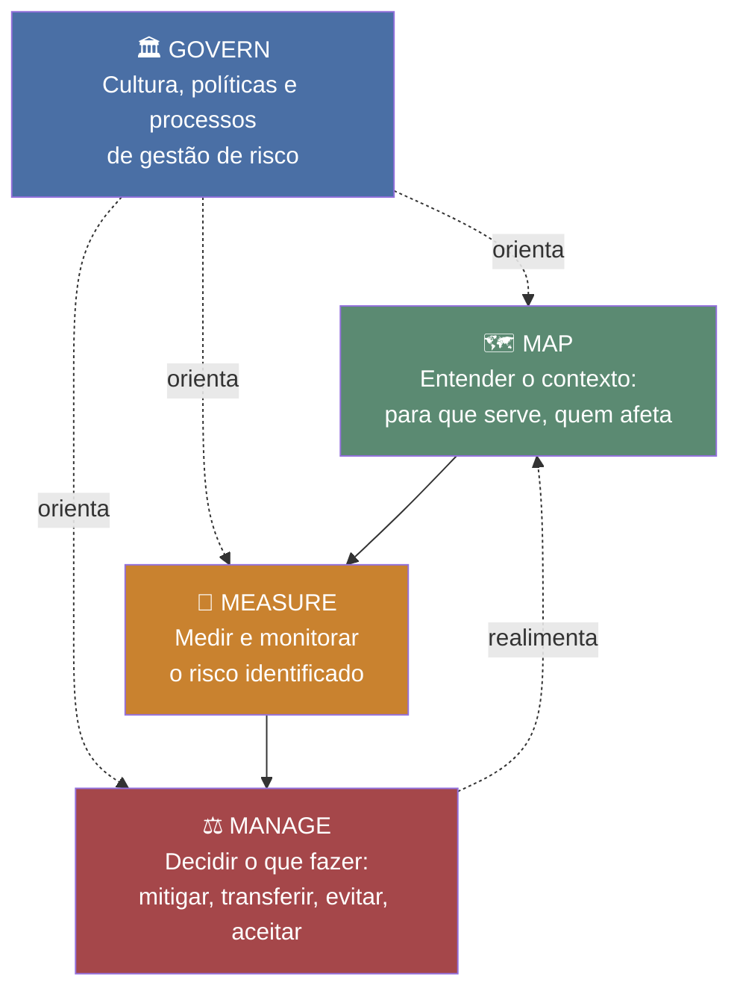

# NIST AI RMF — Guia de Estudo (para quem não é técnico)

O **NIST AI RMF** é um "manual de boas práticas" para organizações que usam Inteligência Artificial gerenciarem os riscos que ela traz — não é uma ferramenta técnica, é um **guia de governança**: como organizar processos, responsabilidades e decisões para que a IA seja usada de forma segura e confiável. Se você trabalha num banco que está adotando IA (como o C6), esse é o tipo de framework que orienta "o que perguntar" e "o que garantir" antes, durante e depois de colocar um sistema de IA no ar.

---

## Glossário rápido

| Sigla / Termo | O que significa |
|---|---|
| **NIST** | *National Institute of Standards and Technology* — o instituto de padrões técnicos do governo dos EUA. É quem publica normas técnicas usadas no mundo todo (não só nos EUA). |
| **AI RMF** | *AI Risk Management Framework* — "Framework de Gestão de Risco de IA". O documento oficial se chama **NIST AI 100-1**, publicado em janeiro de 2023. |
| **Framework** | Uma estrutura organizada de conceitos e passos para resolver um problema — não é um software, é um "roteiro" ou "modelo mental" que a organização segue. |
| **Governança de risco** | O processo de identificar, entender, medir e decidir o que fazer com riscos — quem é responsável, como se documenta, como se prioriza. |
| **AI Actor** | Qualquer pessoa ou organização que tem um papel ativo no ciclo de vida de um sistema de IA (quem projeta, constrói, usa, é afetado, etc.) — ver seção própria abaixo. |
| **Trustworthy AI** | "IA confiável" — o conjunto de características que um sistema de IA precisa ter para ser considerado seguro e digno de confiança (ver seção própria abaixo). |
| **Voluntário / não-prescritivo** | O AI RMF não é uma lei nem uma certificação obrigatória. É a organização que decide se e como vai adotá-lo, adaptando à sua realidade. |
| **AI RMF Profile** | Uma "versão customizada" do framework genérico, aplicada a um caso específico (ex: IA generativa, um setor regulado, um tipo de produto). |
| **AI Lifecycle** | O "ciclo de vida" de um sistema de IA — todas as fases pelas quais ele passa, do design até ele ser desligado/aposentado. |

---

## Por que esse framework existe

Sistemas de IA — principalmente os baseados em machine learning — se comportam de um jeito bem diferente de um software tradicional:

- Eles **dependem muito dos dados** usados para treiná-los (um software tradicional segue regras fixas escritas por um programador; a IA "aprende" padrões a partir de exemplos).
- Seu comportamento pode ser **difícil de prever ou explicar totalmente** de antemão.
- O risco **não é fixo**: pode mudar depois que o sistema já está no ar, conforme os dados mudam ou ele é usado em situações diferentes das previstas originalmente.

Por isso, gerenciar risco de IA não é a mesma coisa que gerenciar risco de um software comum — e é exatamente essa lacuna que o AI RMF tenta preencher. O framework nasceu de um processo bem aberto e colaborativo: consulta pública em 2021, vários rascunhos públicos ao longo de 2022, até a versão final em janeiro de 2023.

O AI RMF é organizado em duas partes:
1. **Parte 1 — Entender o risco**: o que é risco de IA, por que é difícil medir e priorizar, e quais são as características de uma "IA confiável".
2. **Parte 2 — O que fazer na prática**: as quatro funções centrais (explicadas abaixo) aplicadas continuamente ao longo do ciclo de vida do sistema.

---

## As 4 funções centrais (o "coração" do framework)

O framework organiza a gestão de risco em quatro funções. Elas **não são um passo-a-passo linear** (fazer uma, terminar, ir para a próxima) — são aplicadas de forma **contínua e repetida**, o tempo todo, durante toda a vida do sistema de IA.

| Função | O que significa na prática |
|---|---|
| **GOVERN** (Governar) | Criar a cultura, as políticas e os processos da organização para lidar com risco de IA. É a base que sustenta as outras três — define "quem decide o quê" e "como isso é documentado". |
| **MAP** (Mapear) | Entender o contexto: para que serve esse sistema de IA, quem vai usá-lo, quem pode ser afetado por ele, como ele se encaixa no negócio. Isso precisa acontecer **antes** de tentar medir ou gerenciar o risco. |
| **MEASURE** (Medir) | Usar ferramentas e métodos (quantitativos ou qualitativos) para analisar, avaliar e monitorar o risco identificado no MAP. |
| **MANAGE** (Gerenciar) | Decidir o que fazer com os riscos medidos: mitigar (reduzir), transferir, evitar ou aceitar — com base em quanto risco a organização tolera e no que é prioridade. |

*Leitura do diagrama: GOVERN não é uma etapa isolada — ele "banha" as outras três o tempo todo. MAP → MEASURE → MANAGE formam um ciclo que se repete continuamente, não uma linha de chegada única.*

---

## As 7 características de uma "IA confiável" (Trustworthy AI)

Nenhuma característica sozinha garante que um sistema é confiável — e melhorar uma pode **piorar outra** (por exemplo: aumentar a privacidade às vezes reduz a explicabilidade). O framework trata essas sete como necessárias em conjunto, equilibradas caso a caso.

| Característica | O que significa, em linguagem simples |
|---|---|
| **Válida e confiável** *(Valid and Reliable)* | O sistema faz o que promete fazer, e dá pra confirmar que os resultados estão corretos nas condições esperadas. |
| **Segura** *(Safe)* | Não coloca em risco vidas, saúde, propriedade ou o meio ambiente — mesmo em uso indevido previsível. |
| **Segura e resiliente** *(Secure and Resilient)* | Resiste e se recupera de ataques, falhas e acessos não autorizados. |
| **Responsável e transparente** *(Accountable and Transparent)* | Dá pra saber quem responde pelos impactos do sistema, e existe visibilidade sobre como ele funciona. |
| **Explicável e interpretável** *(Explainable and Interpretable)* | Humanos conseguem entender e questionar como o sistema chegou a um resultado. |
| **Focada em privacidade** *(Privacy-Enhanced)* | Protege a autonomia das pessoas e reduz riscos relacionados à coleta e uso de dados pessoais. |
| **Justa, com viés controlado** *(Fair — with Harmful Bias Managed)* | Evita reforçar discriminação injusta ou resultados desiguais entre grupos de pessoas. |

---

## Quem são os "AI Actors"

"AI Actor" é o termo guarda-chuva do framework para **qualquer pessoa ou organização com papel ativo** na vida de um sistema de IA — não é só quem programa.

**Papéis ligados a uma tarefa/fase do ciclo de vida:**

| Papel | O que faz |
|---|---|
| AI Design | Define objetivos e requisitos do sistema, antes de ele ser construído. |
| AI Development | Constrói, treina e implementa o sistema. |
| AI Deployment | Coloca o sistema para funcionar de verdade (integração, lançamento). |
| Operação e Monitoramento | Roda o sistema no dia a dia e acompanha seu comportamento ao longo do tempo. |
| TEVV *(Test, Evaluation, Verification, and Validation)* | Confirma, de forma independente, que o sistema atende aos requisitos e se comporta como esperado. |
| Fatores Humanos | Cuida de como humanos interagem com o sistema, são afetados por ele e o supervisionam. |
| Especialista de Domínio | Traz conhecimento do "mundo real" (ex: crédito, saúde) para garantir que o design faz sentido na prática. |

**Outros atores afetados ou envolvidos, mesmo sem operar o sistema diretamente:**

- **Terceiros** — fornecedores e parceiros que contribuem com dados, componentes ou serviços.
- **Usuários finais** — quem de fato usa o sistema ou consome seus resultados.
- **Indivíduos/comunidades afetadas** — pessoas impactadas pelas decisões do sistema, mesmo sem usá-lo diretamente.
- **Público em geral** — a sociedade como um todo, interessada em como a IA é governada mesmo sem interação direta.

Um ponto importante do framework: parte do risco de IA **não está no modelo em si**, mas em como humanos interagem com ele — por exemplo, confiar demais numa resposta da IA sem questionar ("viés de automação"), ou uma pessoa afetada não ter como contestar uma decisão automatizada. Por isso é tão importante ter supervisão humana de verdade, não só formal.

---

## Exemplo aplicado (cenário ilustrativo)

> ⚠️ Este é um exemplo hipotético para ilustrar o framework — não é um caso real do C6 Bank nem um fato extraído do vault.

Imagine que o banco está lançando um **modelo de IA para pré-aprovação de limite de crédito**. Como o AI RMF ajudaria a pensar nesse projeto?

- **GOVERN** — Antes de qualquer linha de código: quem no banco é responsável por aprovar esse modelo? Existe uma política de quando um humano precisa revisar uma decisão do modelo?
- **MAP** — Para que serve exatamente esse modelo? Quem são os clientes afetados? Existe risco de discriminar algum grupo de clientes sem perceber (ex: por CEP, histórico bancário)?
- **MEASURE** — Como vamos medir se o modelo está sendo justo entre diferentes grupos de clientes? Como vamos medir a taxa de erro (aprovações que não deveriam ter sido feitas, ou negações injustas)?
- **MANAGE** — Se descobrirmos que o modelo está sendo menos preciso para um determinado grupo de clientes, o que fazemos: ajustamos o modelo, adicionamos revisão humana obrigatória para esses casos, ou pausamos o uso até corrigir?

Repare que isso não é um checklist único feito uma vez — o ciclo GOVERN→MAP→MEASURE→MANAGE se repete conforme o modelo é usado, os dados mudam, e novos tipos de cliente aparecem.

---

## Como isso se conecta com AISVS e o OWASP GenAI Top 10

O AI RMF é o nível **mais alto e mais amplo**: governança organizacional de risco de IA em geral (não é específico de segurança nem de IA generativa). Os outros dois temas de estudo são mais técnicos e operacionais:

- **[[owasp-aisvs]]** (AI Security Verification Standard) é uma lista de **requisitos de segurança verificáveis** — mais "checklist técnico" para times de engenharia/segurança testarem um sistema de IA específico.
- **[[owasp-genai-llm-top10]]** é uma lista dos **10 riscos mais críticos** especificamente em aplicações que usam LLMs (modelos de linguagem, tipo os que tem por trás de chatbots de IA generativa).

Na prática: o AI RMF ajuda a decidir *"como vamos governar risco de IA como organização"*; AISVS e o GenAI Top 10 ajudam a responder *"o que precisamos verificar/testar tecnicamente em um sistema de IA específico"*. O próprio GenAI Top 10 cita o AI RMF (e seu perfil complementar para IA generativa, o **NIST AI 600-1**) como uma das referências às quais mapeia seus 10 riscos.

---

## Perguntas frequentes

**O AI RMF é obrigatório?**
Não. É voluntário — a organização escolhe se e como adota. Isso é uma decisão de design proposital do NIST, para que o framework funcione em setores, tamanhos de empresa e tecnologias diferentes.

**O AI RMF substitui outras normas de segurança/risco que o banco já segue?**
Não — ele foi feito para **conversar** com frameworks já existentes (Cybersecurity Framework, Privacy Framework, ISO 31000, entre outros), não para substituí-los. Ele cita explicitamente vários desses frameworks como complementares.

**"IA confiável" quer dizer que a IA nunca erra?**
Não. Significa que o sistema é válido, seguro, seguro contra ataques, transparente, explicável, respeita privacidade e é justo — mas as 7 características envolvem trade-offs entre si; não existe um sistema "perfeito" em todas ao mesmo tempo, existe um equilíbrio adequado ao contexto de uso.

**Quem é responsável por aplicar o AI RMF — só o time técnico?**
Não. A ideia de "AI Actors" é justamente mostrar que responsabilidade é distribuída: design, desenvolvimento, operação, mas também quem supervisiona humanamente, quem é especialista do domínio de negócio, e até quem é afetado pelo sistema tem um papel a considerar.

**Isso é a mesma coisa que "compliance" ou "auditoria de IA"?**
É relacionado, mas mais amplo — compliance/auditoria tendem a verificar conformidade com regras específicas; o AI RMF é um jeito de **pensar e organizar** a gestão de risco de ponta a ponta, do qual auditoria e compliance são uma parte.

---

## Fontes consultadas no vault

[[nist-ai-risk-management-framework]] · [[ai-rmf-core-functions]] · [[ai-rmf-profile]] · [[ai-rmf-risk-framing-challenges]] · [[trustworthy-ai-characteristics]] · [[ai-actor-taxonomy]] · [[ai-lifecycle-dimensions]] · [[human-ai-interaction-risk]] · [[ai-risks-vs-traditional-software-risks]] · [[related-risk-governance-frameworks]] · [[genai-top10-framework-mappings]]
