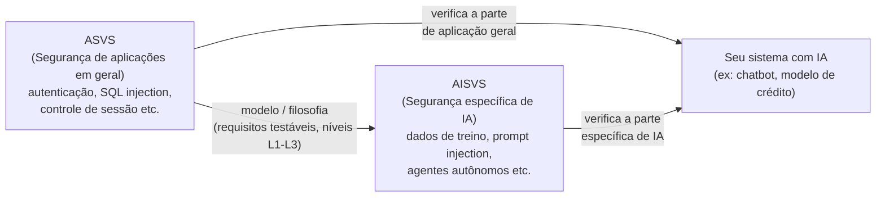
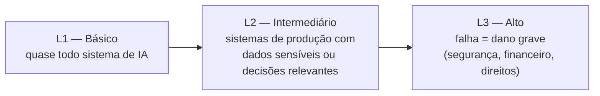

# OWASP AISVS — Guia de Estudo

> Como saber se um sistema de IA é "seguro o suficiente"? O AISVS é, na prática, uma lista de verificação (um checklist) que dá uma resposta concreta e testável para essa pergunta — em vez de ficar só no discurso de "vamos ter cuidado com a IA".

## Glossário rápido

| Sigla / Termo | O que significa |
|---|---|
| **OWASP** | *Open Worldwide Application Security Project* — uma organização sem fins lucrativos que publica padrões de segurança de software usados no mundo todo. Não vende nada, não é de um país ou empresa específica — é um esforço colaborativo aberto. |
| **AISVS** | *AI Security Verification Standard* — o padrão da OWASP com uma lista de requisitos de segurança **testáveis** especificamente para sistemas com IA. |
| **ASVS** | *Application Security Verification Standard* — o padrão "pai" da OWASP para segurança de aplicações em geral (sem ser específico de IA). O AISVS foi construído usando o ASVS como modelo. |
| **Requisito verificável/testável** | Uma regra que dá para checar objetivamente se foi cumprida ou não — não é uma recomendação vaga tipo "seja cuidadoso", é algo como "o sistema deve registrar toda alteração no modelo em produção". |
| **Nível de verificação (L1/L2/L3)** | Uma escala de rigor: quanto mais crítico o sistema, mais alto o nível exigido. Detalhado mais abaixo. |
| **Categoria de controle** | Um grupo temático de requisitos (ex: "como validamos os dados de treinamento", "como controlamos quem acessa o modelo"). O AISVS tem 12 dessas categorias. |
| **MITRE ATLAS** | Um catálogo de técnicas de ataque conhecidas contra sistemas de IA (o "manual de golpes" que os atacantes usam) — várias exigências do AISVS existem justamente para se defender de técnicas catalogadas ali. |

## O que é o AISVS e por que ele existe

Imagine que sua equipe construiu um assistente de IA (um chatbot, um modelo que aprova crédito, um copiloto de código). A pergunta "esse sistema é seguro?" é vaga demais para responder com sim ou não. O AISVS resolve isso transformando "seguro" numa lista concreta de itens verificáveis — cada um pode ser checado, testado, auditado.

É importante notar a diferença de papel em relação a outro framework que você provavelmente também vai estudar, o **NIST AI RMF**: o AI RMF ajuda a organização a **decidir e governar** como lidar com risco de IA (processo, responsabilidades, cultura). O AISVS entra depois, na ponta técnica: **dado que decidimos que segurança importa, como verificamos concretamente se o sistema atende?** Um é sobre governança, o outro é sobre verificação técnica — e eles são pensados para se complementar, não competir.

O AISVS (versão 1.0) foi lançado em 24 de junho de 2026 e cita explicitamente outros frameworks com os quais se conecta em vez de substituir, como o **NIST AI RMF**, o **ISO/IEC 42001** (padrão internacional de sistema de gestão de IA) e o **MITRE ATLAS** (catálogo de ataques adversariais contra IA, usado como base para várias das exigências).

## Como o AISVS se relaciona com o ASVS

O ASVS já existia antes, como o padrão de segurança de aplicações "tradicionais" da OWASP (sem IA). Quando a IA passou a fazer parte dos sistemas, ficou claro que era preciso um padrão à parte — não porque a segurança tradicional deixou de importar, mas porque a IA introduz riscos que o ASVS simplesmente não cobre (dados de treinamento envenenados, um modelo que "alucina" respostas, um agente que executa ações autônomas indevidas etc).

Por isso o AISVS foi desenhado com um **escopo propositalmente estreito**: ele não repete o que o ASVS já cobre (autenticação de usuário comum, proteção contra SQL injection, etc.) — ele foca só no que é **específico de IA**. Na prática, os dois devem ser usados **juntos**: o ASVS cuida da aplicação em geral, o AISVS cuida da parte de IA dentro dela.

## As 12 categorias centrais do AISVS (C01–C12)

Cada categoria agrupa requisitos testáveis sobre um tema. Pense nelas como "capítulos" de uma checklist:

| # | Categoria | O que verifica, em linguagem simples |
|---|---|---|
| C01 | Integridade e Rastreabilidade dos Dados de Treinamento | Os dados usados para treinar/ajustar o modelo vieram de onde deveriam e não foram adulterados no caminho? Dá para rastrear a origem? |
| C02 | Validação de Entrada | O que o usuário digita (ou envia) para a IA é checado antes de ser processado — incluindo tentativas de manipular o modelo via texto ("prompt injection", explicado no guia do GenAI Top 10)? |
| C03 | Gestão do Ciclo de Vida do Modelo e Controle de Mudanças | Existe controle e auditoria de quando um modelo é treinado, atualizado, publicado ou aposentado — como um "histórico de versões" com responsáveis? |
| C04 | Segurança de Infraestrutura, Configuração e Implantação | O ambiente onde o modelo roda (servidores, armazenamento) está configurado com segurança e protegido contra acesso indevido? |
| C05 | Controle de Acesso e Identidade | Só quem deveria tem acesso ao modelo, aos dados e às ferramentas que ele usa — com o mínimo de privilégio necessário? |
| C06 | Segurança da Cadeia de Suprimentos de Modelos | Modelos, datasets e bibliotecas de terceiros usados no sistema têm origem confiável e verificada (evitando um "ingrediente" comprometido entrar na receita)? |
| C07 | Comportamento do Modelo, Controle de Saída e Garantia de Segurança | As respostas do modelo ficam dentro de limites seguros esperados — incluindo mitigar "alucinações" (o modelo inventando informação falsa com aparência de verdadeira)? |
| C08 | Segurança de Memória, Embeddings e Banco de Dados Vetorial | A "memória" que sistemas de IA usam para buscar informação (bancos de dados vetoriais, usados por exemplo em RAG — explicado abaixo) está protegida contra contaminação ou acesso indevido? |
| C09 | Orquestração e Segurança Agêntica | Quando a IA age de forma autônoma em várias etapas (um "agente" que toma decisões e executa ações), existem freios para impedir que ela vá longe demais sozinha? |
| C10 | Segurança do MCP (*Model Context Protocol*) | Requisitos específicos para quando a IA usa o MCP — um protocolo que permite conectar a IA a ferramentas e sistemas externos — garantindo que uma ferramenta externa comprometida não vire uma porta de entrada para o atacante. |
| C11 | Robustez Adversarial | O modelo resiste a tentativas deliberadas de manipulação, como "jailbreaks" (convencer a IA a ignorar suas próprias regras) e outros truques para forçar comportamento indevido? |
| C12 | Monitoramento, Logs e Detecção de Anomalias | Se algo suspeito acontecer em produção (tentativa de ataque, comportamento estranho do modelo), isso é **detectável** — ou só descobrimos depois que já causou dano? |

> Além das 12 categorias, o AISVS tem apêndices de apoio: um **Glossário** de termos, um **Inventário de Controles** (uma tabela de referência cruzada ligando cada controle às ameaças que ele mitiga) e uma seção específica sobre segurança de **IA usada para gerar código**.

## Os níveis de verificação (L1, L2, L3)

Nem todo sistema de IA precisa do mesmo rigor — um chatbot de FAQ interno não tem a mesma criticidade que um modelo que decide se alguém recebe um empréstimo. Por isso, cada requisito do AISVS é marcado com um nível:

| Nível | O que significa | Quando se aplica |
|---|---|---|
| **L1** | Requisitos básicos, o "mínimo aceitável" | Praticamente qualquer sistema com IA, mesmo os de baixo risco |
| **L2** | Nível intermediário, mais rigoroso | Sistemas em produção que lidam com dados sensíveis ou tomam decisões que afetam pessoas — a maioria dos sistemas "sérios" deveria mirar aqui |
| **L3** | Nível mais alto de exigência | Sistemas onde uma falha da IA pode causar dano grave — à segurança das pessoas, financeiro ou a direitos fundamentais |

## Exemplo aplicado (cenário ilustrativo)

*O exemplo abaixo é uma ilustração hipotética para fixar o conceito — não é um fato registrado no vault sobre o C6 especificamente.*

Imagine que o C6 está avaliando dois sistemas de IA:

1. **Um chatbot interno de RH** que responde dúvidas sobre política de férias. Baixo risco se errar — provavelmente basta atender **L1**: validação básica de entrada (C02), controle de acesso simples (C05) e algum log de uso (C12).
2. **Um modelo que ajuda a decidir limite de crédito de um cliente**. Aqui o risco é alto — uma falha pode causar prejuízo financeiro real ou tratamento injusto de um cliente. Esse sistema deveria mirar **L2 ou L3**: rastreabilidade completa dos dados de treinamento (C01), auditoria de cada mudança no modelo (C03), monitoramento robusto de anomalias (C12), e controles adversariais fortes (C11) para garantir que ninguém consiga manipular a decisão.

Nos dois casos, o time de segurança usaria o AISVS como um **checklist de auditoria**: pega a categoria relevante, confere item por item se o requisito daquele nível está implementado, e documenta o que falta.

## Como isso se conecta com o NIST AI RMF e o OWASP GenAI Top 10

Os três temas de estudo se encaixam assim:

- **[[nist-ai-rmf]]** — governança: como a organização decide, organiza e monitora sua postura de risco de IA como um todo (processo, papéis, cultura).
- **AISVS (este documento)** — verificação técnica: um checklist testável para confirmar que um sistema específico atende a requisitos concretos de segurança.
- **[[owasp-genai-llm-top10]]** — uma lista das vulnerabilidades mais comuns e conhecidas em sistemas de LLM/IA generativa (tipo um "top 10 dos erros mais perigosos"), servindo como referência de *o que pode dar errado*.

Existe inclusive uma tabela oficial (um dos apêndices do GenAI Top 10) que faz o "de-para" entre cada uma das dez vulnerabilidades do Top 10 e as categorias de controle do AISVS que ajudam a mitigá-las — ou seja, os três frameworks foram desenhados para se falar entre si, não para serem estudados isoladamente.

## Perguntas frequentes

**Preciso implementar as 12 categorias inteiras de uma vez?**
Não necessariamente — o padrão é pensado para ser aplicado por nível de criticidade do sistema. Um sistema de baixo risco pode ficar só em L1 em todas as categorias; um sistema crítico deve subir para L2/L3 nas categorias mais relevantes para ele.

**AISVS substitui o ASVS?**
Não. Eles se complementam — o ASVS cuida da segurança "geral" da aplicação, o AISVS cuida só da parte específica de IA.

**Quem usa o AISVS na prática?**
Desenvolvedores, arquitetos, engenheiros de segurança e auditores — qualquer pessoa envolvida em construir, testar ou auditar um sistema com IA.

**O AISVS diz *como* corrigir os problemas?**
Não exatamente — ele diz *o que* verificar (é uma lista de verificação, não um manual de implementação passo a passo). Ele costuma apontar para outras referências (como o MITRE ATLAS) para entender a ameaça por trás de cada requisito.

**Por que ele cita tantos outros padrões (NIST AI RMF, ISO 42001, MITRE ATLAS)?**
Porque nenhum framework sozinho cobre tudo — o AISVS foi desenhado para se encaixar num ecossistema maior de governança e segurança de IA, não para ser usado isolado.

## Fontes consultadas no vault

[[aisvs-standard]] · [[aisvs-core-categories]] · [[owasp-asvs]] · [[ai-security-controls-inventory]] · [[genai-top10-framework-mappings]] · [[related-risk-governance-frameworks]]
